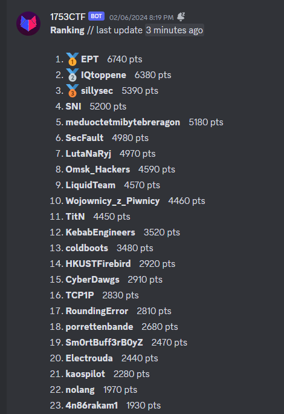
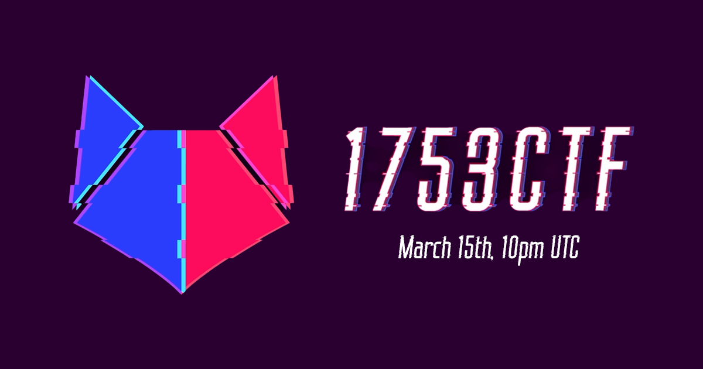

# 1753ctf 2024

Played this CTF with `@morty` and `@dec0y` and as team `kaospilot`. This whole CTF was on a discord server. I personally prefer CTFd over this. It was hard to keep track of the challenges. But it was still a CTF and had some great challenges.

I only wrote writeups on those I participated on. We completed 13/26 challenges.

## Writeups

- [MISC       //   👨🏻‍🦳 Mr. Zenek](./misc-mr-zenek/README.md)
- [MISC       //   🌤️ Weather](./misc-weather/README.md)
- [OSINT      //   🙈 Fixed Mistake](./osint-fixed-mistake/README.md)
- [WEB/CRYPTO //   👯 Ticket API](./web-crypto-ticket-api/README.md)
- [WEB        //   💬 Flag GPT](./web-flag-gpt/README.md)
- [WEB        //   🔐 Flag Vault](./web-flag-vault/README.md)
- [WEB        //   😇 It Works!](./web-it-works/README.md)
- [WEB        //   🪄 Kind of Magic](./web-kind-of-magic/README.md)
- [WEB        //   🧑‍🎨 Text Polyfill](./web-text-polyfill/README.md)

## Completed but with no writeup

MISC    //   🤖 Sanity Check
STEGANO //   ✈️ The Constant
REV     //   ⏰ Yesterday's News
CRYPTO  //   🔗 Unbreakable

# We got 21th place

# Logo

