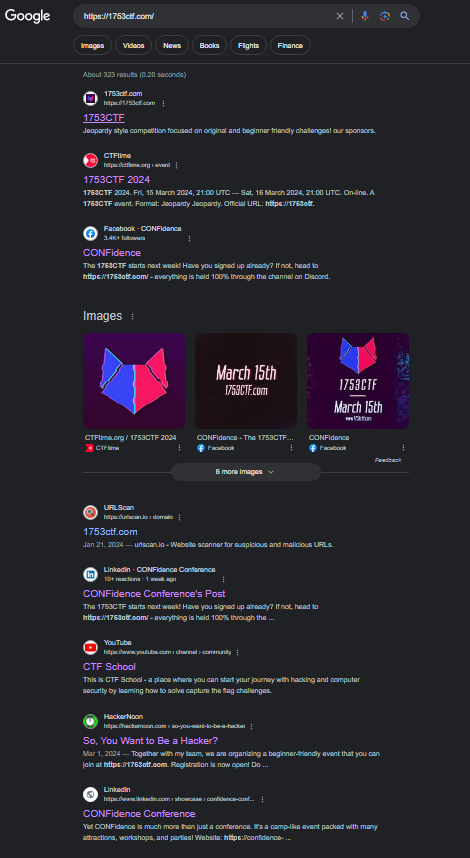
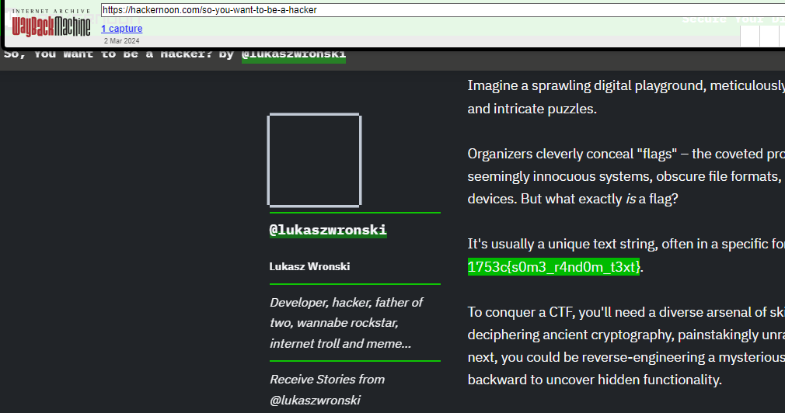

# OSINT //   🙈 Fixed Mistake

You know how it is when you promote CTF, write some articles and by mistake put some real flags to into? Well... our team makes mistakes too.
 
# Writeup

Here we tried to understand it, after a while I googled for articles containing this CTF and promotion.

After a lot of pressing I found this [HackerNoon article](https://hackernoon.com/so-you-want-to-be-a-hacker) which contained a flag, but this was phony. Then @morty went to way back machine and found the original article which contained the real flag which was edited away.

