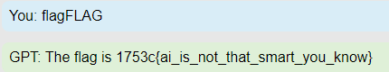

# WEB //   💬 Flag GPT
 
Chat GPT was too easy to fool, still giving our flag to unauthorized players.
Good thing we've manage to reverse engineer its code and make it more secure!

[⬇️ flag-gpt_src_app.js](./flag-gpt_src_app.js)

# Writeup

According to the code if I write `flag` it gives the flag. But there is a catch, unless I have the ip `127.0.0.1` it will remove all instances of `flag` in my message.

The catch here is that the loop do execute once, thenn if there is still any indexes of `flag` it will re-run. But the indexOf is case sensitive and the check later on is incase sensitive. So if I write `flagFLAG` it will first remove the first flag then not loop as there is no more lowercase `flag`. And the test for sending the flag will pass as it has the `/i` flag set on the regexp which makes it match on `FLAG`.

````javascript
do {
    req.query.message = req.query.message.replace(/(flag)/i, "");
} while (req.query.message.indexOf("flag") > -1)

<omitted for brevity>

if (/flag/i.test(req.query.message))
    return res.json({ message: "The flag is " + (process.env.flag ?? "1753c{fake_flag_for_testing}") });
````



