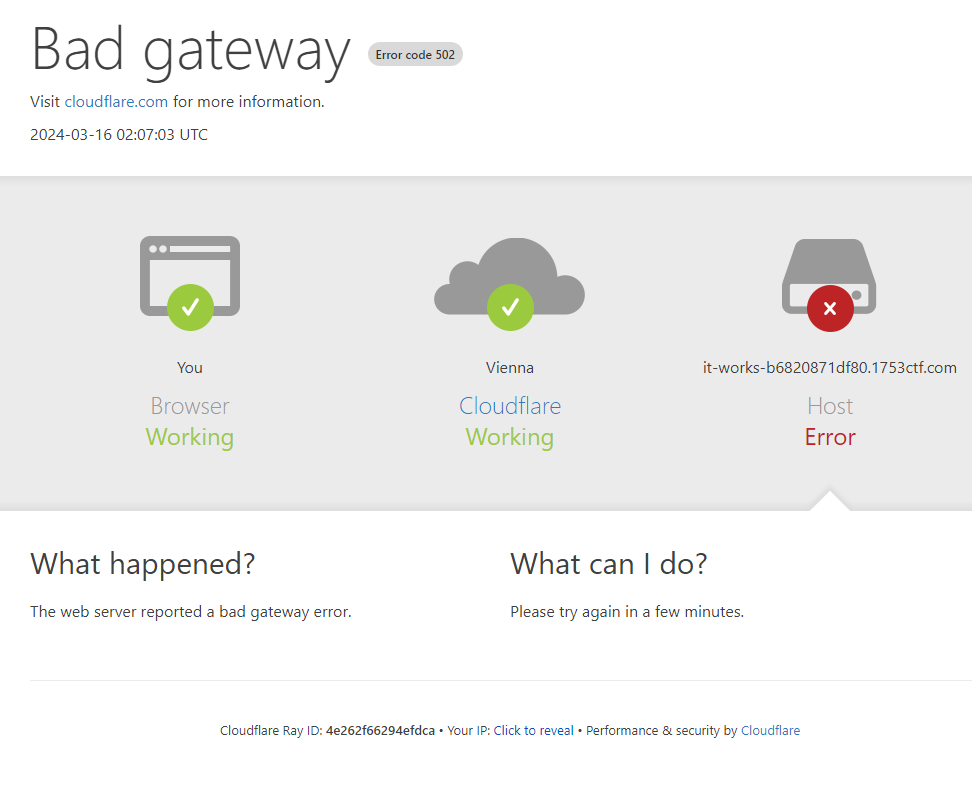
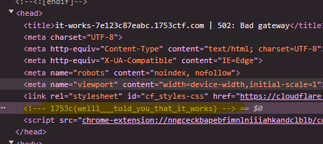

# WEB //   😇 It Works!
 
Trust me. It works!

# Writeup

First looked at this and gave up as it shows a very realistic cloudfront error:

But when I checked the host URL it shows the same page so it was a fake one, then Decoy found the flag in the source code. Well it explains the `trust me, it works` part.

