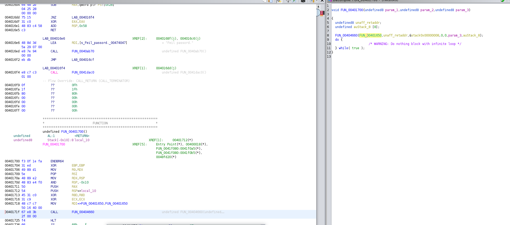

# Find ELF Entrypoint

Snipped from [stackexchange](https://reverseengineering.stackexchange.com/questions/18088/start-analysis-at-any-position-in-elf-is-entry-point)

# Guide

Entry point is the "keyword" used to point at the location at which the OS loader will start a program. For a given binary file (ELFBIN), you can run the following command to read the binary's header information (-h):

```console
$ readelf -h hvitboks
ELF Header:
  Magic:   7f 45 4c 46 02 01 01 03 00 00 00 00 00 00 00 00 
  Class:                             ELF64
  Data:                              2's complement, little endian
  Version:                           1 (current)
  OS/ABI:                            UNIX - GNU
  ABI Version:                       0
  Type:                              EXEC (Executable file)
  Machine:                           Advanced Micro Devices X86-64
  Version:                           0x1
  Entry point address:               0x401700
  Start of program headers:          64 (bytes into file)
  Start of section headers:          36575784 (bytes into file)
  Flags:                             0x0
  Size of this header:               64 (bytes)
  Size of program headers:           56 (bytes)
  Number of program headers:         10
  Size of section headers:           64 (bytes)
  Number of section headers:         30
  Section header string table index: 29
```

or you can use `objdump -f`

```console
$ objdump -f hvitboks

hvitboks:     file format elf64-x86-64
architecture: i386:x86-64, flags 0x00000102:
EXEC_P, D_PAGED
start address 0x0000000000401700
```

If you look closely, you'll find Entry point address : 0x401700. After running objdump on the binary and looking up the given address you'll obtain something this:

```console
$ objdump --start-address 0x401700 -d hvitboks | awk '{print $0} $3~/retq?/{exit}'
0000000000401700 <.text+0x640>:
  401700:       f3 0f 1e fa             endbr64
  401704:       31 ed                   xor    %ebp,%ebp
  401706:       49 89 d1                mov    %rdx,%r9
  401709:       5e                      pop    %rsi
  40170a:       48 89 e2                mov    %rsp,%rdx
  40170d:       48 83 e4 f0             and    $0xfffffffffffffff0,%rsp
  401711:       50                      push   %rax
  401712:       54                      push   %rsp
  401713:       45 31 c0                xor    %r8d,%r8d
  401716:       31 c9                   xor    %ecx,%ecx
  401718:       48 c7 c7 50 16 40 00    mov    $0x401650,%rdi
  40171f:       67 e8 3b 2f 00 00       addr32 call 0x404660
  401725:       f4                      hlt
  401726:       66 2e 0f 1f 84 00 00    cs nopw 0x0(%rax,%rax,1)
  40172d:       00 00 00 
  401730:       f3 0f 1e fa             endbr64
  401734:       c3                      ret
```

This is the **_start** function that prepares certain parameters/registers before eventually calling main (see the label on the right at address **401718** in the example) that contains "your" code. The **_start** function is usually called after all other sections of the binary have been loaded in memory. After the main is done, the **hlt** instruction is executed to terminate the execution in this example.

Here is how it looks in ghidra, you see the address `0x401650` is defined as a function and as a parameter to the libc entrypoint.



This is what's called **entry point**. Now, regarding analysis, it has to be started somewhere in the binary, that somewhere is represented using an address (like the entry point). If you want to play with the language/jargon, you can say: analysis entry point rather than binary entry point.

All in all, it's just technical keywords and they have to be defined properly.
