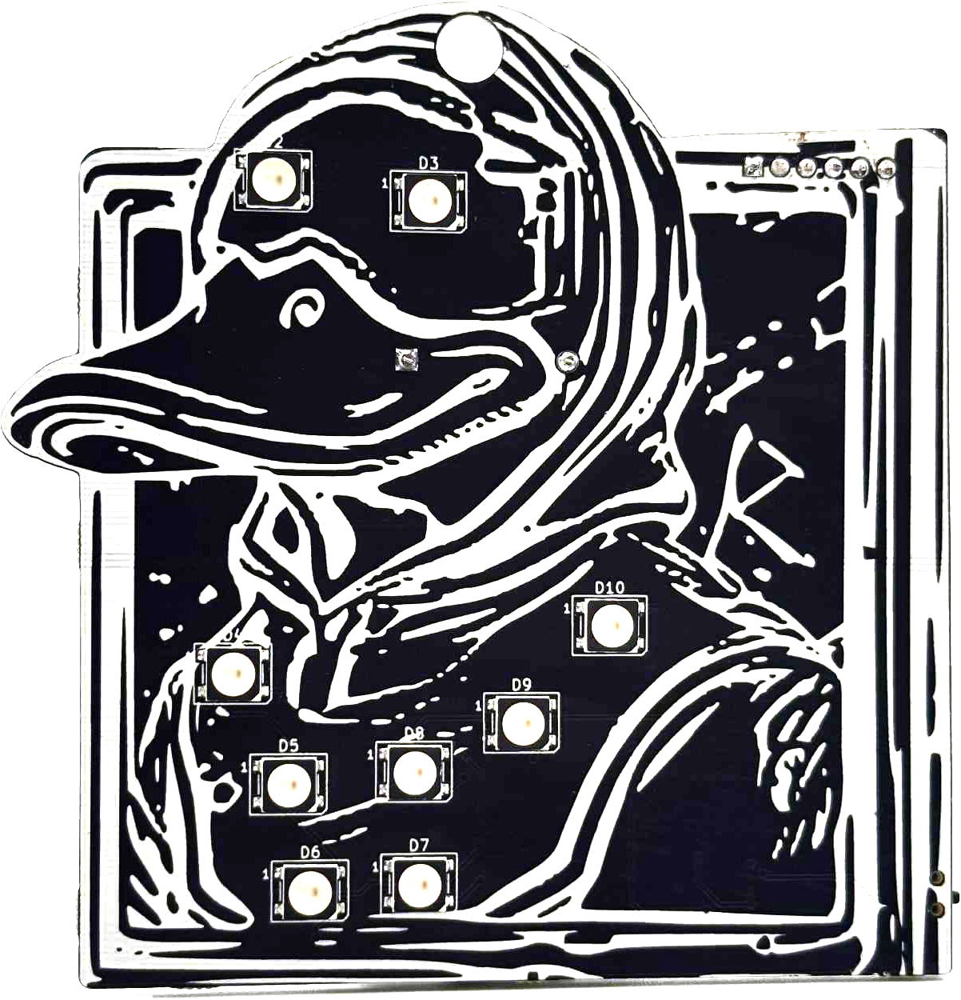
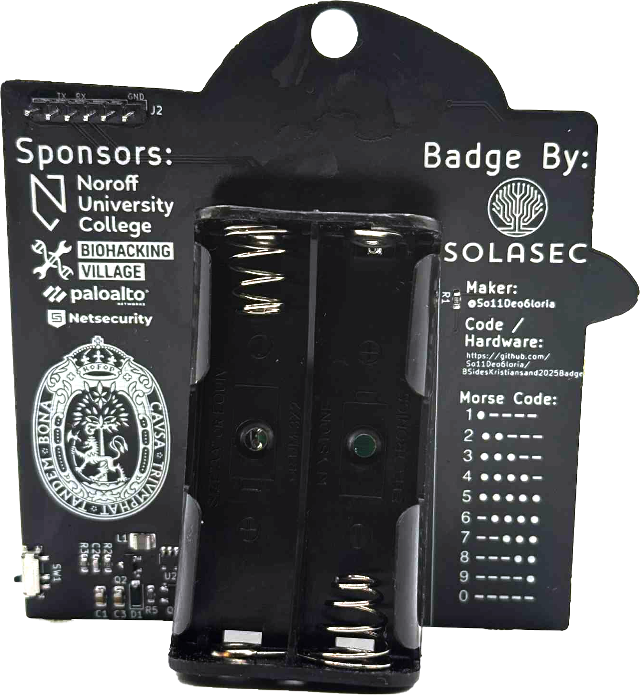
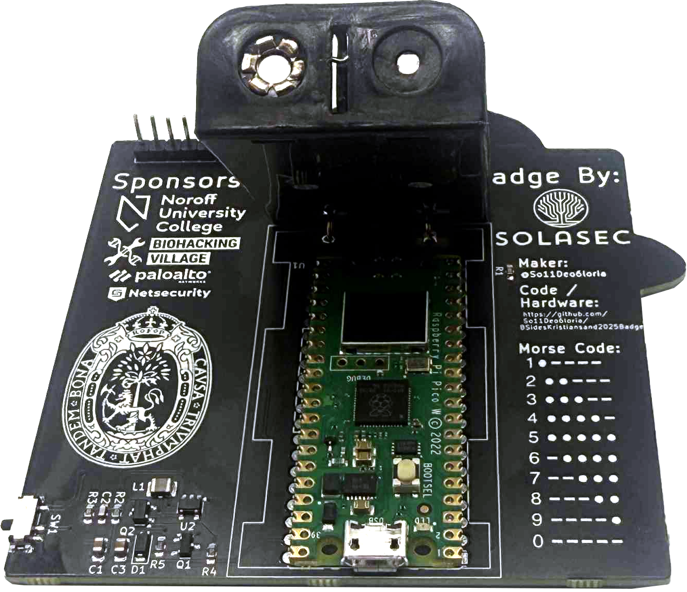

# BSides Kristiansand 2025 Badge

I've heard there was a badge to hack at the BSides Kristiansand cybersecurity conference and since I was attending I brought my computer, FTDI adapter and some jumper wires.

# Initial Thoughts

When arriving we recieved the badge and two batteries. Looking at it I initially found:

- UART Pin header
- Raspberry Pi Pico with micro usb
- Toggle Switch
- Morse Code Table
- GitHub link

The device has to work offline so all flags are stored on them, accessing the file system would likely give me all flags. Also looking at the source as long as you know the device ID you can re-generate all flags based on the source of [flagManager.py](https://github.com/So11Deo6loria/bsidesKristiansand2025Badge/blob/main/firmware/flagManager.py)

But lets not start there, lets do it the intended way.

## Badge Images

# Flags

| **Flag No** | **Title**     | **Description**                             | **Link**                     |
|-------------|---------------|---------------------------------------------|------------------------------|
| Flag 1      | Easy          | Free flag shown when browsing the webserver | [Link](./flag1/)             |
| Flag 2      | Comms         | Serial port flag                            | [Link](./flag2/)             |
| Flag 3      | Creds         | Hidden HTML on credits page                 | [Link](./flag3/)             |
| Flag 4      | Firmware      | In firmware source                          | [Link](./flag4/)             |
| Flag 5      | Authorized    | Javascript bypass                           | [Link](./flag5/)             |
| Flag 6      | Respond       | SSID discovery                              | [Link](./flag6/)             |
| Flag 7      | Secure        | File system access                          | [Link](./flag7/)             |
| All         | Alternative way | Reversing source                          | [Link](./fastlane/)          |

# Conclusion

The badge as my first was a fun challenge, Used a bit too long to get a stable connection but when we figured out what the problem was and I got to borrow a USB cable it was all jolly from there.

Thanks for a great new piece on my CTF journey!