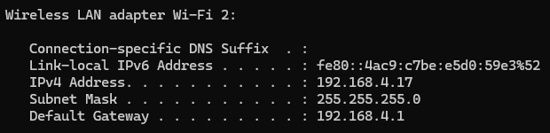
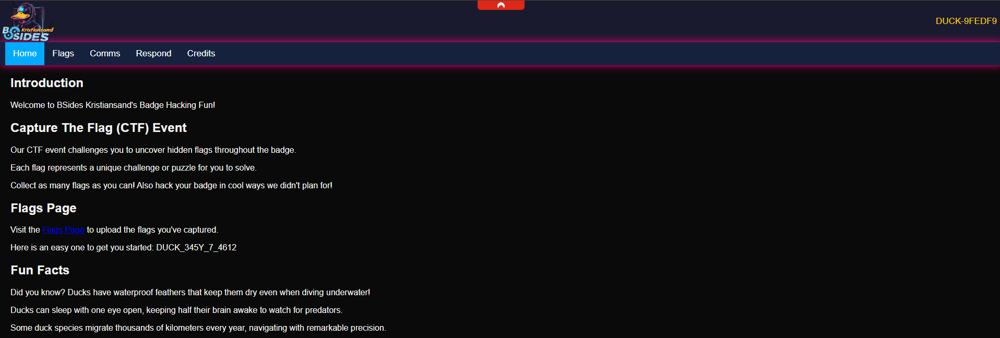

# Easy Flag (1)

Firstly I tried to boot it with the UART connected but just got garbeled data, usually the baud rate is wrong so I tried a few other rates. None gave me data. Then I went to the Badge Intro Track and learned that it was hostig an access point.

Now moving to the source code I quickly see in [main.py](https://github.com/So11Deo6loria/bsidesKristiansand2025Badge/blob/main/firmware/main.py) that it [generates](https://github.com/So11Deo6loria/bsidesKristiansand2025Badge/blob/main/firmware/main.py#L24) a 8 digit password for the AP and configures the access point.

```python
password = helpers.generate_password(device_id)

#...
#<redacted for brevity> 
#...

# Generate random psk and store in database
if configManager.configData['apPassword'] == 'password':
	configManager.update_config('apPassword', password)

if configManager.configData['apPassword'] == password:
	print(f"Blinking Morse {password}")
	ledManager.blink_morse(password)

#...
#<redacted for brevity> 
#...

networkManager = NetworkManager(device_id, configManager.configData['apPassword'], networkSetting) 
scanManager = ScanManager(networkManager.wlan, flagManager)
serialManager = SerialManager()

```

The most important part is the `Blinking Morse` part, looking at the `ledManage.blink_morse` it shows that it blinks the `picoLED` which is the led on the board. Now when booting I can see it blinks a password!


Using the morse table on the PCB I dechifered the blinking to `42634014` and found out by signal strength that my device id was most likely `DUCK-9FEDF9`.

Trying to connect gives me an error, so after a few interesting tracks at BSides I took it up to [Caleb](https://github.com/So11deo6loria) which connected it via USB and was able to verify the password was correct and he got a successfull connection.

We concluded that the battery was weak so I replaced it and got connection. (Later on I borrowed a MicroUSB to keep it online as this thing ate batteries!).

Looking at the `router` ip address of the PC connected to the WiFi shows that it is `192.168.4.1` which is the badge's ip.



Opening this and Caleb points me to the first flag on the website.



Inserting it and the Badge makes a pretty lightshow and voila! Flag 1 completed!