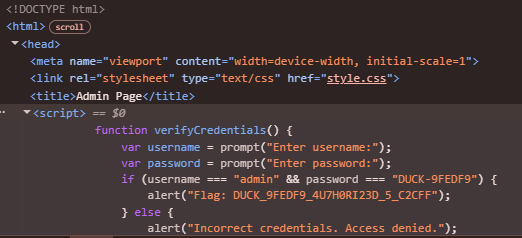

# Authorized Flag (5)

In [main.py](https://github.com/So11Deo6loria/bsidesKristiansand2025Badge/blob/main/firmware/main.py#L58C1-L62C82) there is the following code which seems to be referencing `authorized`:

```python
@app.route('/admin')
async def admin(request):
	gc.collect()
	flag = flagManager.retrieve_flag('authorized')
	return await Template('admin.html').render_async(device_id=device_id, flag=flag)
```

Looking at the [admin.html](https://github.com/So11Deo6loria/bsidesKristiansand2025Badge/blob/main/firmware/templates/admin.html#L13) it seems to get a flag on line 13, this is deliverd though the Template engine. So all I did was open `/admin` and peaked at the source and got the flag:



It does require you to "login" and if you cancel it redirects you away, but just quickly pressing escape stops that so you can easily get the source.

Alternative you could use curl:

```bash
$ curl -s http://192.168.4.1/admin | grep DUCK_
                                alert("Flag: DUCK_9FEDF9_4U7H0RI23D_5_C2CFF");
```