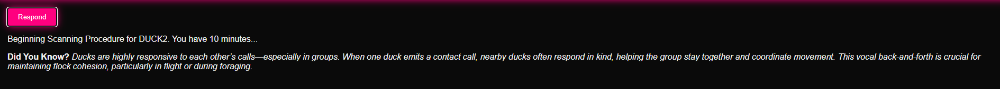
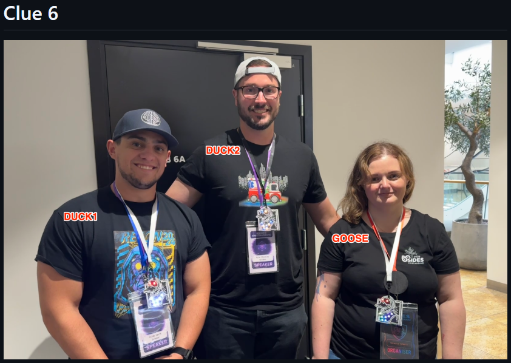

# Respond Flag (6)

Here I had to read the source a bit better. Seeing [respond.html](https://github.com/So11Deo6loria/bsidesKristiansand2025Badge/blob/main/firmware/templates/respond.html) having a button, once pressed it seems to be looking for a random duck, either `DUCK1`, `DUCK2` or `GOOSE`.

Exploring the source code it seems to do a wifi scan and look for those SSID's. Then once it found the one it is looking for it saves that it has found that and then you can do the next.

Once you find all 3 SSID's it will show the flag.

So for this one I did set my iPhone's SSID to be whatever it was looking for

 once it found it I changed it and when I got all 3 then voila! Flag secured!

 ## Update

 Intended solution was that three people did have badges sending those SSID's and you were supposed to go up to them and solve it.

 

 Oh well, whatever floats the boat. I could also easily get the flags from the source code but where's the fun in that! :)