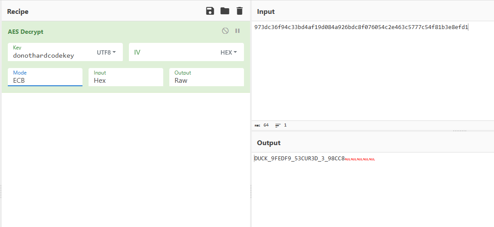
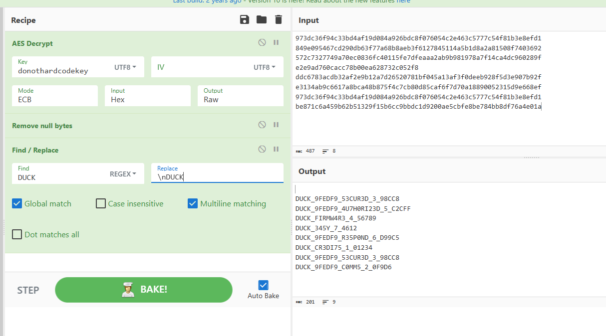

# Secure Flag (7)

Here I had no clue on what to do so I thought I cheated by connecting to the Pi with microusb and accessing the remote shell for micropython and dumped the flag database file.

```bash
root@Ubuntu:/# rshell

Connecting to /dev/ttyACM0 (buffer-size 32)...

Trying to connect to REPL  connected

Retrieving sysname ... rp2

Testing if sys.stdin.buffer exists ... Y

Retrieving root directories ... /.micropico/ /.vscode/ /apConfig.json/ /config.json/ /configManager.py/ /constants.py/ /contributors.json/ /encrypted_db.json/ /flagManager.py/ /helpers.py/ /images/ /js/ /ledManager.py/ /main.py/ /microdot/ /neopixel.py/ /networkManager.py/ /scanManager.py/ /serialManager.py/ /static/ /templates/ /tinydb/ /utemplate/

Setting time ... Jun 06, 2025 23:42:18

Evaluating board_name ... pyboard

Retrieving time epoch ... Jan 01, 1970

Welcome to rshell. Use Control-D (or the exit command) to exit rshell.

/> cat /encrypted_db.json/

{"flags": {"5": {"flag": "authorized", "data": "849e095467cd290db63f77a68b8aeb3f6127845114a5b1d8a2a81508f7403692", "status": true}, "4": {"data": "572c7327749a70ec0836fc40115fe7dfeaaa2ab9b981978a7f14ca4dc960289f", "flag": "firmware", "status": true}, "7": {"flag": "easy", "data": "e2e9ad760cacc78b00ea628732c052f8", "status": true}, "6": {"data": "ddc6783acdb32af2e9b12a7d26520781bf045a13af3f0deeb928f5d3e907b92f", "flag": "respond", "status": true}, "1": {"flag": "credits", "data": "e3134ab9c6617a8bca48b875f4c7cb80d85caf6f7d70a18890052315d9e668ef", "status": true}, "3": {"flag": "secured", "data": "973dc36f94c33bd4af19d084a926bdc8f076054c2e463c5777c54f81b3e8efd1", "status": true}, "2": {"data": "be871c6a459b62b51329f15b6cc9bbdc1d9200ae5cbfe8be784bb8df76a4e01a", "flag": "comms", "status": true}}}/> 
```

Seeing in [flagManager.py](https://github.com/So11Deo6loria/bsidesKristiansand2025Badge/blob/main/firmware/flagManager.py#L10) we see that the encryption flag is `donothardcodekey` and it uses an AES encryption we used CyberChef to generate a receipt to decode them:



For good measure we could now also get all flags using this:

