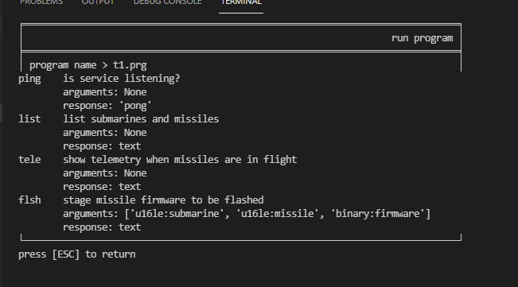
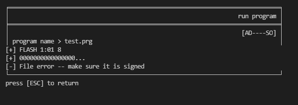

# 2.15_firmware_staged

Klarte denne før 2.14. Her styret jeg mye og leste om ASM kode for å finne utav hvordan jeg skal bruke denne. Etter å ha fått tilgang forstod jeg jo fort at jeg kunne laste opp programmer og kjøre i ren ASM formatert som hex. 

Så begynnte med en kjapp `mov x1, x2` som ifølge [armconverter](https://armconverter.com/?code=mov%20x1,%20x2) var `e10302aa` og fikk kjapt en panic. Jaja får se på de eksisterende, så jeg begynnte å se på `findflag.prg` og `uid.prg`. Bare panics når jeg prøvde å modifisere. 

Etter mye om og men så ble det til at jeg må faktisk lære meg ASM tenkte jeg. Så jeg begynner å google og søke opp. Men uansett om jeg lærer får jeg ingenting ut av det, vet jo ikke hvor jeg skal snakke eller hva jeg skal? Da spurte jeg jeg om tips fra e-tjenesten fikk tips om `Hei! Har du sammenlignet programmene du har lastet opp med de som ligger der fra før?` dette fikk meg til å se på telemetry.prg som jeg tenkte ikke var noe. 

Begynnte å disassemble hele greia, brukte [armconverter](https://armconverter.com/) og fikk ASM kode fra det. La dette i en fil og begynnte å lære meg om hva hver kommando gjorde. Etterhvert hadde jeg følgende fil [telemetry.asm](telemetry.asm)

Basert på ny kunnskap prøver jeg å modifisere assembly'n og endrer "tele" til "upload" og laster opp. Overskriver rett og slett 6 bytes og ser hva som skjer. 



Dette viser jo at jeg er på rett vei, styrer mye og vel. Til slutt forstår jeg hva hele koden gjør i psudokode:

```cpp
s = socket()
connect(socket, "127.0.0.1", 1025)
write(socket, "tele")
while socket_has-data:
  read(socket, data)
  write(stdout, data)
close(s)
return 0
```

Så da begynner jeg å prøve å lage noe som fungerer:

```asm
sxtw x4, w0           # Store stdout pointer to x4
mov x0, x4            # Set parameter 1 to x4
mov x1, sp            # Set parameter 2 to sp
mov x2, 0xFFF         # Set parameter 3 to 0xFFF
mov x8, #0x40         # Run system call 'write' 
svc #0                # Execute: write(x4, sp, 0FFF);
mov w0, #0            # Set return value to 0
ret                   # Return

HEX: 047c4093e00304aae1030091e2ff81d2080880d2010000d400008052c0035fd6
```

Jepp, her har vi noe som kjører og printer ut stacken. Nå begynner flere dager med modifikasjoner. Manuellt endre `telemetry.prg` til å bestå av samme koden bare den laster opp en hel fil også. Så jeg endrer så adressinfo start på 0xBC i filen. Og payload lander i 0xCC og utover. Siden jeg ikke legger til instrukser går dette ganske greit. Endrer så 0xCC til å bestå av de 3 parameterene som `flsh` krevde. Så endrer jeg write system call til å lese 16 bytes istede. Bygger så denne payloaden:

```
66 6c 73 68 01 00 01 00 00 00 00 00 00 00 00 00
```

Dette blir da "flsh" etterfulgt av submarine 1, misile 1 og binary er 8 tomme bytes. Får modifisert og får vellykket opplasting. Suksess!!! Med lykkerus og alt tenker jeg at det bare er å modifisere nå write kommandoen til å lese 



Så da tenker jeg kanskje jeg må bruke den ferdige signerte fila, så i teorien bare å hive på firmwaren i bakkant av denne `missile.1.3.37.fw` og endre tallet til å være... 160964 + 8 bytes for "flsh", sub og missil. Så endre `movz  x2, #0x4` med `movz  x2, #160973` og la på filen. Opplastingen tok evigheter. `konekt` har innebygget delay. 

Siden `konekt` er en wrapper for kobling mot `mad:1337` så lager jeg et python script [file_upload.py](file_upload.py) som gjør dette. Men får ikke tak i `mad` fra corvax så da blir det portforward: `ssh -L 1337:mad:1337 a` 

Scriptet [firmware_upgrade.py](firmware_upgrade.py) blir laget og kjørt og dette funker men panic! Igjen.. Hvorfor? Åja der ser jeg at armconverter viser `### Unknown error` på `movz`'en min. Etter litt googling så er tallet for høyt. Kan maks ha `64435`. Så etter mer googling viser det seg at det er kun mulig om man tar det i 2 operasjoner. Trist og lei meg. Så ble det mange timer med å manuellt endre assembly kommandoene og prøve å få dette til. Flytte frem og tilbake og "kode" i assembly. 

Fikk så et tips fra Vealending om at kanskje det var lettere å bruke `asm` fra `pwntools` og jeg begynner å etterforske. Etterhvert finner jeg utav at denne gjør det samme som armconverter men man har også `shellcraft`. Så begynner å lage noen få programmer, får litt mer og mer fremgang og til slutt står det er komplett script. Ikke lenger trenger jeg å laste opp hele missilfilen inni programmet, kan heller finne det på filsystemet.

Well, [generate_flash_asm.py](generate_flash_asm.py) er oppe å kjører og dette er kjernen, så enkelt kunne det gjøres. Men jeg har hvertfall lært litt om assembly :) 

```python
shellcode += shellcraft.connect("127.0.0.1", 1025)                 # create socket and connect, store fd in x12
shellcode += shellcraft.write("x12", payload, len(payload))        # send payload to socket
shellcode += shellcraft.cat("/firmware/missile.1.3.37.fw", "x12")  # send firmware to x12
shellcode += "\tsub sp, sp, 256\n"                                 # Move sp 256 bytes back 
shellcode += "read:\n"                                             # label
shellcode += shellcraft.read("x12", "sp", 256)                     # read 256 bytes from x12 (socket) into stack
shellcode += shellcraft.mov("x2", "x0")                            # move number of read bytes to x2 for later
shellcode += "\tcmp x0, #0\n"                                      # compare number of read bytes with 0
shellcode += "\tb.le  close\n"                                     # branch if less or equal to 0, branch to 'close'
shellcode += shellcraft.write("x4", "x1", "x2")                    # write to stdout from stackpointer
shellcode += "\tb read\n"                                          # branch to 'read'
shellcode += "close:\n"                                            # label 'close
shellcode += shellcraft.close("x12")                               # close socket
```

Kjører så scriptet og får et flagg som gir meg 15?? Jeg lette etter 14.. Jaja 15 viser meg at jeg skal gå tilbake litt, ser ut som jeg må se på 14 videre og heller se på `signer` filen fra `.bash_history` fila.

```
Kategori: 2. Oppdrag
Oppgave:  2.15_firmware_staged
Svar:     7f34ada436059e84fea23eb48c91024c9203638b
Poeng:    5

Wow! Firmware staged for flash når ubåten dykker opp! Oppdragsgiver ønsker at vi skal manipulere målkoordinatene til å treffe et trygt sted (24.1851, -43.3704). Klarer du dette? Firmwaren ser ut til å være beskyttet av en form for signatursjekk. Hvis du klarer å finne en måte å bestå denne sjekken på så kan du levere det du finner med `scoreboard FUNN` for en liten påskjønnelse, hvis du ikke allerede har gjort det.
Analytikerene våre indikerer at ubåt nr. 1 sannsynligvis vil dykke opp i Biscayabukta, ubåt nr. 2 mellom Island og de Britiske øyer, ubåt nr. 3 ca. 100-200 nm sør/sør-øst for Italia, ubåt nr. 4 ca. 300-500 nm sør/sør-vest for Irland, og ubåt nr. 5 ca. 200-400 nm vest for Portugal. Bruk denne informasjonen for å regne ut de parametere du trenger.
Siden alle missilene i hver ubåt skal til samme mål, må firmware være identisk for hvert missil per ubåt.
```