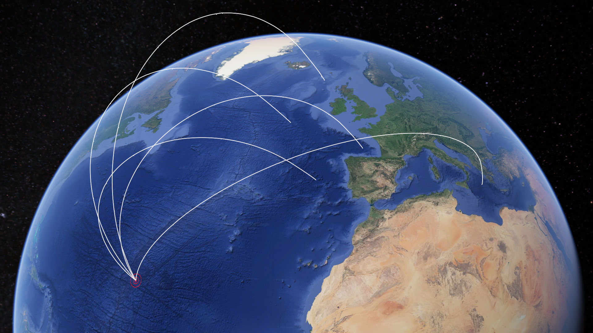

# 2.16

Vi fikk jo etter mye om og men 2.14 og nå kan vi signere nye firmwares. Jeg begynner med å lage et program som kan resignere firmwares som jeg kaller [resign.py](resign.py).

Tester jevnlig og til slutt får jeg noe som funker, laster opp og signatur akseptert!

```python
$ python3 resign.py missile.1.3.37.fw
This is signed, removing signature from upload
Old sign:  260d633fe091a7ef24427cd196c6cd15f81949d56a393e2336e0d00d15fc6d83b709748b70f41846e632afc704f38d9c53fb5094a3c86f2fda97a7413e7a4490
New sign:  d67162308d29b9609edee636f52f7e3394f05c65a76550975995016752fbc132ec12110398e488c59725d6e46f8f7c14ea830c2e62256c1c3ab8cc8e51df3aa1
```

Steg 2, finne ut hvordan vi kan endre målet i firmaren. Etter en del sjekking i Ghidra fant jeg plutselig en sak som het `_target`. 24 bytes med data.

```8402f0e57a404e419c1fedbd9becbfc074f19cd6cd055341```

Så også "_tof" men denne hadde verdier `00 00 00 00`. Jeg regner med det betyr "time of flight" og at den blir kalkulert av systemet.


Han jeg sammarbeidet med her fant til slutt utav at dette var så simpelt som 3 doubles. Vi regnet med det var 3 verdier da target bestod av kordinater.

Vi søkte mye på `missile launch coordinates` og landet sikkert på listene til de fleste byråene som følger med på internett nå. Men etterhvert ga jeg opp. Vi var innom ChatGPT som ga oss disse: 

```
- Geodetic coordinates (latitude, longitude, and altitude), which are used to locate a point on the Earth's surface in a human-readable format.
- Earth-centered, Earth-fixed (ECEF) coordinates, which are a 3D Cartesian coordinate system with the origin at the center of the Earth.
- Topocentric or local-level coordinates, which are used to define positions within a local reference frame (such as relative to a launch site).
- Navigation coordinates, which are based on the missile's current position and velocity.
```

Men ingen av de funka, når jeg Googlet og fant ferdige kalkulatorere. Spurte da om et tips fra Vealending som nevnte at vi var på rett kurs. Viste han hvordan jeg fikk feil på ECEF på nettkalkulatoren, og han nevnte at jeg burde få det til via python istede og få ChatGPT til å skrive det. Desverre feilet ChatGPT men han var hyggelig å delte sitt script.

Basert på dette lagde jeg [ecef_poc.py](ecef_poc.py) som jeg mater med kordinatene til den korteste missilen som jeg forventer lander en plass i Bordeaux, mine forsøk før dette har vært noen hundre meter uttafor byen så med dette scriptet traff den dead on. Da har vi kordinatsystemet. Så var det bare å overtale ChatGPT å lage noe som funket baklengts. Lat / Lon til ECEF.

Kom da med denne som lagde akkurat de samme tallene på kordinatene. Så jeg fikk det til to veier:

```python
def lat_lon_to_ecef_vector(lat, lon):
    lat_rad = lat * math.pi / 180
    lon_rad = lon * math.pi / 180

    x = 6371000 * math.cos(lat_rad) * math.cos(lon_rad)
    y = 6371000 * math.cos(lat_rad) * math.sin(lon_rad)
    z = 6371000 * math.sin(lat_rad)

    return [[x], [y], [z]]
```

Med denne muligheten prøver vi igjen. Modifiserer firmware, signerer, laster opp, skriver. Superglade og kjører simulering. Etter mange timer så er det bare kommet noen få linjer. Dette går gørrtregt. Etter litt snakking med Vealending får jeg tips om at det skal gå ganske kjapt, 1 linje i sekundet minst. Så lurte han lurte på hva min `tof` var. Så jeg fikk litt panikk. Den skal jo være 0? Regner med det ble kalkulert? Neida den var viktig den og.

Oh well, så jeg og Decoy satt oss ned på nytt. Kikket på denne `tof` verdien. Jeg prøver å endre tall, laste opp firmware, se hva som skjer. Får masse rare ting som ikke gir meg mening.

I ghidra ser Decoy at den gjør noen endringer med den verdien mellom `tof` og `_target`. Og vi tenker at det har noe med det å gjøre. Men denne verdien `00 e0 90 40` gir ingen mening. 

Så får jeg et "jadda!!" 

```python
>>> "%7.2f" % struct.unpack("<d", bytes.fromhex("00 00 00 00 00 e0 90 40"))[0]
'1080.00'
```

Verdien er rett og slett en double. Dette her er jeg dårlig på så glad Decoy så det så kjapt.

Da har vi alt vi trenger, vi kan modifisere `TOF` og `Target`. Så [modify_tof_target.py](modify_tof_target.py) blir født. 

Lager verdiene med å modifisere litt på [ecef_poc.py](ecef_poc.py) så setter vi TOF til noe stort og lar den kjøre. Innser fort at dette ikke er meningen, det tar jo flere hundre timer. 

Jeg får da en liten ide, hva om vi finner avstanden til alle missilene, vi vet jo at den ubåt 1 er på `45, -5`. Og så tar vi denne avstanden og deler på tiden som er i sekunder for å finne meter i sekund en missil skyter på?

Etter mye om og men og manuell plotting i diverse nettsider får jeg et plausibelt tall på rundt 4-5000 sekunder.

Lager så et script for å gjøre dette, quick and dirty med mye hjelp fra ChatGPT. Dette her da det er helt på slutten av CTF'en. Scriptet heter [tof-averager.py](tof-averager.py). Her har jeg limt inn alle de orginale missilene. Delt de opp i 5 seksjoner som jeg kan kommentere ut og inn når jeg skal ha en viss ubåt's missiler. Og i bunnen kommenterer jeg ut og inn hvilken ubåt. 

Dette gir da output på ubåt 1 som følger:

```
python3 tof-averager.py 
ill-buzz - dist 809km - 749m/s
tan-city - dist 863km - 799m/s
any-fang - dist 964km - 893m/s
six-crop - dist 946km - 876m/s
few-darn - dist 1010km - 935m/s
its-folk - dist 1210km - 1008m/s
wry-cook - dist 1225km - 1021m/s
few-area - dist 967km - 967m/s
bad-dime - dist 933km - 864m/s
day-acid - dist 1042km - 948m/s
bad-dory - dist 349km - 699m/s
her-chin - dist 1173km - 902m/s
the-clue - dist 520km - 578m/s
sly-chug - dist 983km - 910m/s
one-epee - dist 1584km - 1056m/s
top-game - dist 1454km - 1212m/s
901m/s i snitt over 16 missiler
4151km to safe zone
4608s TOF to safe zone
```

Vi hadde bare circa kordinater på ubåt 3-5 men jeg fant utav om jeg lastet opp et program med tof på 1 minutt fikk jeg kjapt de andre også.

```
ourLoc=(45,-5) # Sub 1
ourLoc=(60,-10) # Sub 2
ourLoc=(37,19) # Sub 3
ourLoc=(50,-20) # Sub 4
ourLoc=(40,-15) # Sub 5
```


Så tof på 4608 skal treffe. Setter da denne toffen (hehe) og laster opp firmwaren og alt og kjører simulering. Tikk takk, etter rundt en times tid får jeg et flagg. 

```
Kategori: 2. Oppdrag
Oppgave:  2.16_submarine_0
Svar:     4312ce7fbaea6a5587634a834afcb495
Poeng:    5

For mission complete må du konkatenere flaggene for 2.16 - 2.20
```

Okei, så da vet jeg at oppdraget er bare å gjøre dette på de 4 andre så har jeg fullført. Er egentlig litt fornøyd med det og tenker å gi meg da jeg ikke har mange timene igjen før kl 00:00 og jeg vet at jeg hadde klart det om jeg hadde startet 100% i desember og ikke ventet til januar. Nevnte dette for etjenesten at jeg var fornøyd men etter litt spurte de om de kunne kjøre simulering med mine firmware filer og se om det ble korrekt. 

Så da ble det å generere tof'er for alle:

```
Sub 1: 4608s
Sub 2: 4886s
Sub 3: 5175s
Sub 4: 4049s
Sub 5: 3432s
```

Genererer så firmwarefiler for dem og sender ferdig signerte fw filer med kordinater og toffene gitt oppe. Og etter en stund får jeg følgende bilde og en log fil.


Viser seg at jeg treffer med rundt 40 meters omkrets, men jeg tar også ned et par starlink sats i prosessen ser det ut som. Ser i loggfilen her har de kjørt på samme måte jeg hadde gjort det bare dems simulering er kanskje litt kjappere, så ser jeg flaggene en etter en :) 

# Resten av flaggene. Kom frem med samme prosedyre som første

```
Kategori: 2. Oppdrag
Oppgave:  2.17_submarine_1
Svar:     9330f6fcf99fb2d1acdeb6e005a9477c
Poeng:    5

For mission complete må du konkatenere flaggene for 2.16 - 2.20
```
```
Kategori: 2. Oppdrag
Oppgave:  2.18_submarine_2
Svar:     4662c0ce7ed7d3cbb814cb60746f1d3a
Poeng:    5

For mission complete må du konkatenere flaggene for 2.16 - 2.20
```
```
Kategori: 2. Oppdrag
Oppgave:  2.19_submarine_3
Svar:     88ff4301442793cb1a1b8ef9c390f7a0
Poeng:    5

For mission complete må du konkatenere flaggene for 2.16 - 2.20
```
```
Kategori: 2. Oppdrag
Oppgave:  2.20_submarine_4
Svar:     963fd1126aa1db3a78d2bc402ee9bf91
Poeng:    5

For mission complete må du konkatenere flaggene for 2.16 - 2.20
```
```
Kategori: 2. Oppdrag
Oppgave:  2.21_mission_complete
Svar:     4312ce7fbaea6a5587634a834afcb4959330f6fcf99fb2d1acdeb6e005a9477c4662c0ce7ed7d3cbb814cb60746f1d3a88ff4301442793cb1a1b8ef9c390f7a0963fd1126aa1db3a78d2bc402ee9bf91
Poeng:    5

Gratulerer! Du har reddet Europa! ... og fullført oppdraget :) Vi er mektig imponert :D

Ny fil: /home/login/2_oppdrag/mission_complete.jpg
```

# Ny fil

Takk for en super CTF E-tjenesten!!!

