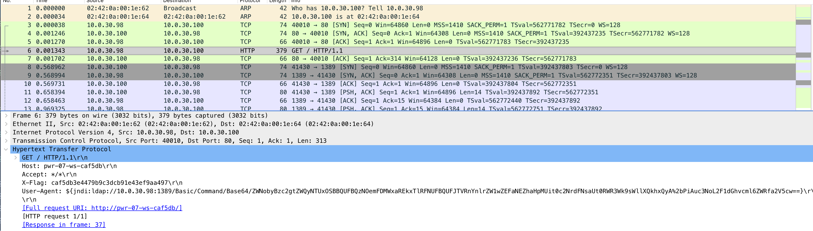

# 2.01 - PCAP

Så kjapt X-Flag i ene HTTP requesten i PCAP filen.



```
Kategori: 2. Oppdrag
Oppgave:  2.01_pcap
Svar:     caf5db3e4479b9c3dcb91e43ef9aa497
Poeng:    10

Gratulerer, korrekt svar!
```