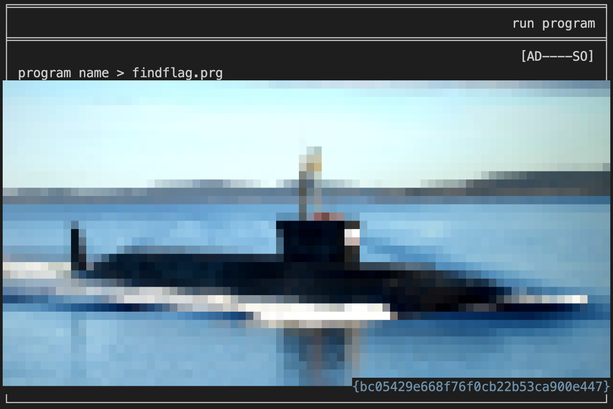

# 2.13_findflag

Leker inne på `konekt` her ligger det mulighet for å se firmware og programfiler. Ene firmware filen er `server-software.tar.xz` 

Vi kan laste ned filen men mottar den som en hexdump. Decoy lagde følgende script som ble brukt for å gjøre det om til binærfil igjen

```python
#!/usr/bin/env python3
import sys
data = open(sys.argv[1], "r").read().split("hex dump")[1].split("────────────────")[0]
buffer = bytearray()
for line in data.split("\n\n"):
    try:
        bytestr = line.split("|")[1].replace("--", '').strip()
    except:
        continue
    buffer += bytearray.fromhex(bytestr)
open(sys.argv[2], "wb").write(buffer)
```

Pakket ut server-software og der ligger `fracture` som jeg åpner i Ghidra. Etter litt analyse ser jeg det er en kommando som henter input (knappene vi trykker for å navigere). 

```c#
ulong ui_read_key(void) {
  ssize_t sVar1;
  ulong uVar2;
  byte local_1;
  
  sVar1 = read(*(int *)(_session + 1),&local_1,1);
  if (sVar1 == 1) {
    _history.0 = (ulong)local_1 | _history.0 << 8;
    if (_history.0 == 0x726f6f646b636162) {
      **_session = **_session ^ 2;
    }
    else if (_history.0 == 0x7363726f6c6c2121) {
      *(byte *)(_session + 2) = *(byte *)(_session + 2) ^ 1;
    }
    uVar2 = (ulong)local_1;
  }
  else {
    uVar2 = 0xffffffff;
  }
  return uVar2;
}
```

Vi ser også vår session på user hvor caps=0x00

```
[0x55000232c0]
name: operator
caps= 0x00 --------
cap#0 0x01    admin:no
cap#1 0x02    devel:no
cap#2 0x04 reserved:no
cap#3 0x08 reserved:no
cap#4 0x10 reserved:no
cap#5 0x20 reserved:no
cap#6 0x40   system:no
cap#7 0x80 override:no
```

Den første iffen sjekker om vi har skrevet `roodkcab` (backdoor baklengst) om vi har det blir vår session XOR'et med 2. Som gjør at vi ender opp med `0x02` og `devel` access. 
Den andre iffen sjekker om vi har skrevet `scroll!!`, denne skrur på så skjermen ikke blir clearet men hver nye side lander under. Mao vi har en scrollbar terminal. Dette skjer på adressen til _session + 2. Her flipper den kun 1 bit.

Trykket mye frem og tilbake med disse to inputtene, og fant en oppskrift hvor jeg skrev `roodkcab`. Gikk inn på user og skrev `scroll!!` to ganger så fikk jeg full access. Men etterhvert fant jeg utav at det kun var fordi jeg via `r` kom inn på rename og renamet meg selv til `oll!!`. Rename funksjonen kjører en valideringssjekk og om den feiler så skjer det noe krøll med sessionen min. `!` er et ugyldig tegn i navnet så derfor feilet det.

Når jeg forstod dette så jeg at jeg også fikk ugyldig navn om antall tegn var 0. Så rett og slett rename meg til blankt ga samme access. Det var en del kjappere :) 

Kan da kjøre programmer så prøver å kjøre `findflag.prg` og der kommer et fint bilde av en ubåt og et flagg.



```
Kategori: 2. Oppdrag
Oppgave:  2.13_findflag
Svar:     bc05429e668f76f0cb22b53ca900e447
Poeng:    4

Herlig! Vi har nå lov til å kjøre programmer. Kan du bruke dette til noe?
```