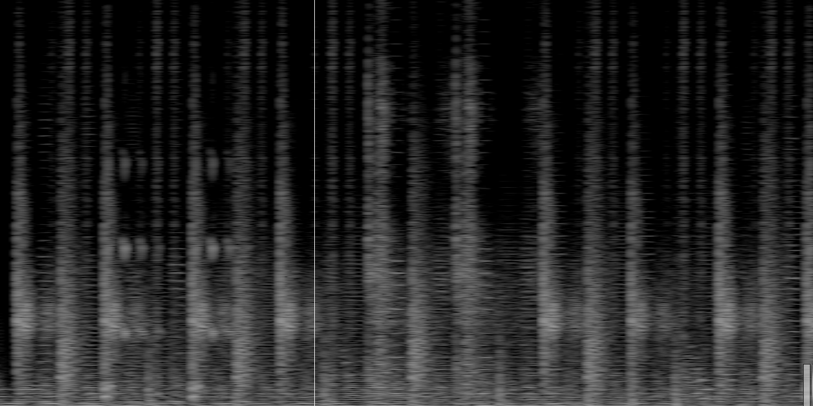
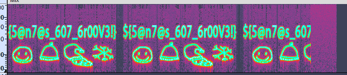

# Challenge

So Santa has got a part time gig DJing for Norwegian christmas parties!

You know them peeps need some monster grooves...

Check out this mix by DJ S himself:

https://htbbinaries.z1.web.core.windows.net/SantasGroovyTheme.mp3

> **Hint:** Well time to google DSP, and what a Drill Sgt might say...

# Writeup

Damn, I never attended to the military, what the heck do he say? Chatbot to the rescue?

```
Question: What doe the drill sgt say?

Answer: It depends on the specific situation and context in which the drill sergeant is speaking. Some common phrases a drill sergeant may use include:

"Attention!"
"Fall in!"
"Move it!"
"Form a straight line!"
"Double time!"
"Drop and give me 20!"
"Get on your feet!"
"This is not a daycare, this is the military!"
"You will do it until you get it right!"
"I am not your friend, I am your drill sergeant!"
```

Nothing here helps me. Of well, I've seen stuff before using images. Lets check them out. I connected my oscilloscope to the jack out on my PC and tried to see if it was music made to create something on screen ref this [Smarter Every Day episode](https://www.youtube.com/watch?v=4gibcRfp4zA). But this was a bust, a single line only.

My next attempt was to check the spectrogram. After stearing at it for multiple hours and then confirming with someone on the discord that the flag is totally visible. Not hard to read at all. Then I knew i was on the wrong place. 



In between the staring and confirming I also did the basic things, strings, binwalk, foremost, hexdump, trying to look for hidden things. Google multiple mp3 steno decoders but no-one works. 

So suddenly it came to me. March! Left right left right. So I googled "mp3 left right ctf" and I found a [ctftime writeup](https://ctftime.org/writeup/8835) to a method of splitting the left and right audio channels. Then inverting the right and merging them on the same side.

Read quickly and understood the assignment.

1. Import to audicity
2. Split channels
3. Set right channel as left channel
4. Invert right channel
5. Merge 
6. Adjust gain to normalize around 20dB
7. Enable spectrogram



Profit.. Now It sounds really weird.. But there the image blows up in my face. Merry christmas! :) 

```
${5@n7@s_607_6r00V3!}
```