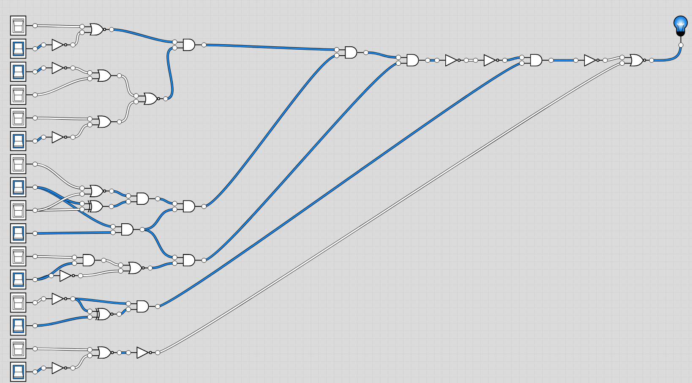

# Challenge

So Santa is having his sleigh fitted with some custom upgrades. This seems like the perfect opportunity to sneak in a little customization of your own. Like a tracking chip, activated by the sleighs mcu firmware. If only you could figure out where this sleigh repair shop is... All you have is this selfie Santa posted on elfieGram to go on... Is that Antarctica?


> **Hint:** Hidden things can be easy to just stumble upon. But some things you need to dig a bit deeper to find the answer beyond. Then when you reach the gates of hell, you need to open them up using your magic spell. Once you finally see the light, your answer will there in plain sight!

# Writeup

I download the image and do exiftool on it, nothing there. I run foremost to check for more files in the file and success. I get a PDF and a PNG extra.

    The PDF contains the logics for different electronic logic gates and the PNG a schematic for a bulb with 16 inputs. Guessing that is a binary number we have to decode (make the LED glow?)

So I quickly draw it up in [Logicly](https://logic.ly/demo/)



And started following the logic and flipping the switches that needs to be flipped. I'm kinda a nerd so this goes fast. Code is:

```
Bin: 0110010101010101
Hex: 0x6551
Dec: 25937
```

Well, what now? Doing more research exiftool shows me that the creator of the pdf is 

```
Creator                         : Espen S. Larsen
Creator Tool                    : Microsoft® Word for Microsoft 365
Create Date                     : 2022:12:06 23:01:16+01:00
Modify Date                     : 2022:12:06 23:01:16+01:00
Document ID                     : uuid:CB27F39D-A166-4FBF-A7D3-946929FC7AB7
Instance ID                     : uuid:CB27F39D-A166-4FBF-A7D3-946929FC7AB7
Author                          : Espen S. Larsen
```

What where you doing up so late? Are you Santa? Have the mystery been solved? I guess not, lets continue.

After staring on the image of a freaking santa, analyzing pixels e.t.c for a good half hour. (#goodtoiletbreak) I came to the conclusion that there is nothing there? Oh well. Tried strings on the image and.. I saw something there in the start, an url.

```
$ strings southpoleselfie.png | grep http
http://southpolecustoms.norwayeast.azurecontainer.io:1338/%PDF-1.7
```

I went to that url and found a computer. Put in the binary I found and voila. Something happend.


`Sleight tracker deployed` Popped up on the display. Well that is not good enought? No flag.. Luckily I early opened the inspector and I checked the code it seems to post to /bin. I had a /bin post request and there was the missing ${}'s

```{"msg":"${SLEIGH_TRACKER_DEPLOYED}"}```