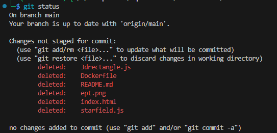

# INSUFFICIENT

This website is from a developer that left the company to focus 100% on CTFs. When he left, he was mumbling something about a secret he had hidden in the git repo... Can you help us find it?
He is lazy and well known to clone git, deploy on the spot and leave everything...

Site: insufficient.io.ept.gg

# Writeup

The text talks about git repo, so I opened the url with curl

``` bash
└─$ curl https://insufficient.io.ept.gg/.git/HEAD 
ref: refs/heads/main
```

Removing the HEAD shows that directory listing is on aswell. So I can just download the whole folder:

```
wget -r curl https://insufficient.io.ept.gg/.git/
```

Then I can enter the folder wget creates and do `git status`



Using `git checkout -- .` I restore all files but find nothing. `git branch -a` shows a `secrets` branch so I just quickly check it out and there is `snotes.md` containing the flag.

# Flag

```
EPT{1n5uff1c13n7_cr3d3n7141_hy613n3}
```