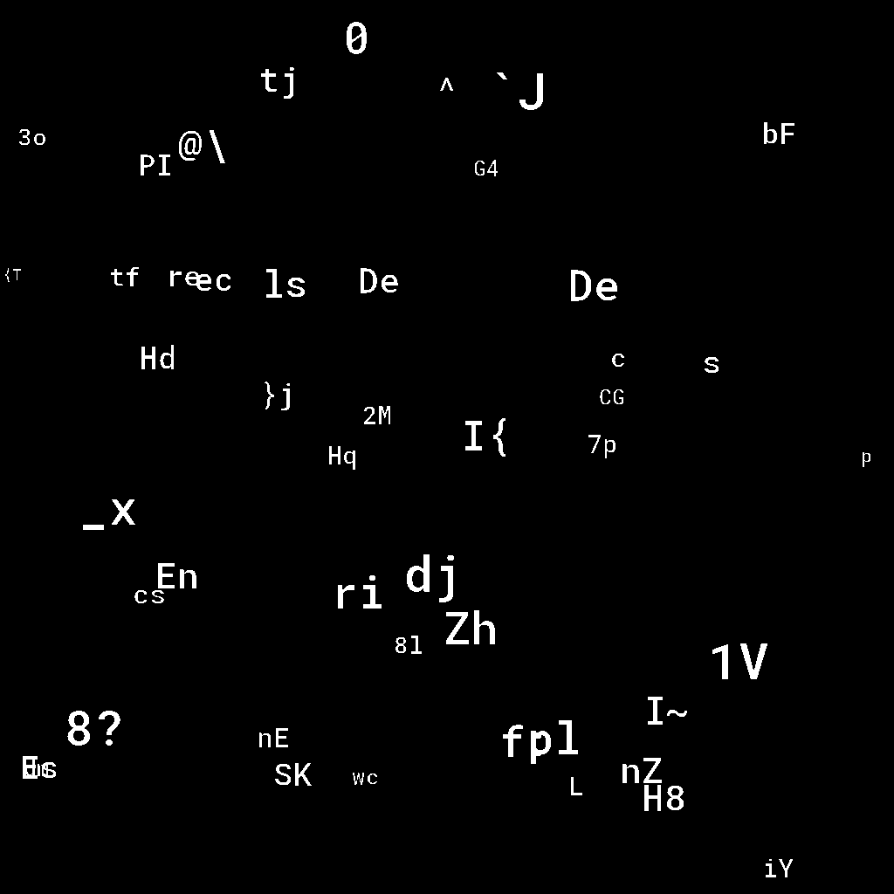

# Trede (449)

Det ble etterhvert klart at fremmede makter ville destabilisere nasjonen med å slippe løs et ikke navngitt Trøndersk rockeband. For å unngå massive landeplager måtte vi nå finne ut hvem dette kunne være.

Her er det viktig at man tenker innenfor boksen og i flere dimensjoner.

[oppgave3.pcap](oppgave3.pcap)

# Writeup

Same thing as Ende and Tode but this is 3D. Not able to extract the code here. 



```
task3_1 = "Det bli itj svin-hett uten alpefett"
task3_2 = "Det bli itj n\303\245 liv uten kniv"
task3_3 = "Du f\303\245r itj rota hvis rutan itj e sota"
task3_5 = "Bli itj n\303\245 barsk uten karsk"
```

I'm unsure on what the 3rd dimmension gives here. No logical method to see this.

# Flag

```
```