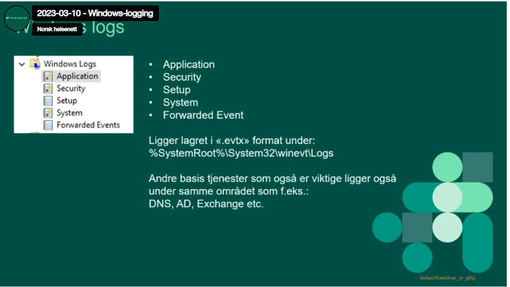

# webinar (489) 

HelseCERT liker å formidle informasjon og kunnskap. Siden 2021 har HelseCERT holdt temabaserte webinaerer. I vårt siste webinar om Windows-logging har vi skjult et flagg.

NB! Dette er ikke en stego-oppgave, du må se webinaret for å finne flagget.

# Writeup

Googled `helsecert webinar` and found [this](https://vimeo.com/806667945/644a590a20) videmo video. 

Scrubbed through until I found a flag at `03:40` bottom right .



# Flag

```
helsectf{webinar_er_g0y}
```