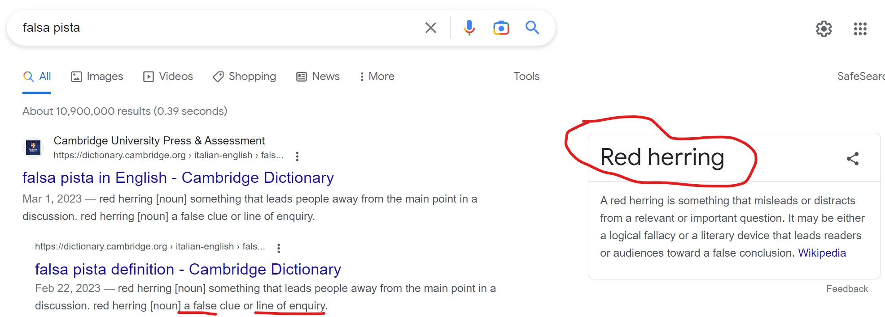
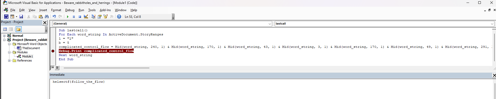

# Beware rabbitholes and red herrings (490)

Maldocs er ofte obfuskert...

Zipfilen kan åpnes med passord: "helsectf". OBS: Disse filene er laget for å være ganske like som ekte maldocs og AV kan trigge på de.

[Beware_rabbitholes_and_herrings.zip](Beware_rabbitholes_and_herrings.zip)

# Writeup

Starting strong here with [olevba](olevba.txt). It has some base64 data saying `Subfunctions vs functions, what's the difference`. Heck I dont know.. But I tend to figure that out.


```vb
Function suggerimento() As String
suggerimento = "c3ViLXZzLWZ1bmN0aW9uLXZiYQo="
End Function

Sub falsapista(flagg)
Dim command As String
one = "$bytes = [Convert]::FromBase64String($b64);"
two = "$filename = $starter + 'falsapista.zip';"
three = "$starter = pwd;"
six = "$b64      = "
nine = "[IO.File]::WriteAllBytes($filename, $bytes)"
command = six

For Each falsapista In ActiveDocument.StoryRanges
    command = command + falsapista
Next falsapista

command = command + ";"
command = command + three + four + two + ten + one + nine
PS_Execute (command)

falsapista = "c3ViLXZzLWZ1bmN0aW9uLXZiYQpIdmEgZXIgZm9yc2tqZWxsZW4="
End Sub

Public Sub PS_Execute(ByVal sPSCmd As String)
'Setup the powershell command properly
sPSCmd = "powershell -command " & sPSCmd
'Execute and capture the returned value
CreateObject("WScript.Shell").Exec (sPSCmd)
End Sub

Sub lastcall()
For Each word_string In ActiveDocument.StoryRanges
l = "l"
b = 5
complicated_control_flow = Mid(word_string, 240, 1) & 
                            Mid(word_string, 170, 1) & 
                            Mid(word_string, 43, 1) & 
                            Mid(word_string, 3, 1) & 
                            Mid(word_string, 170, 1) & 
                            Mid(word_string, 49, 1) & 
                            Mid(word_string, 291, 1) & 
                            Mid(word_string, 59, 1) & 
                            Chr(Int(Mid(word_string, 18, 1) & 2 & Mid(word_string, 102, 1))) & 
                            Mid(word_string, 59, 1) & 
                            Mid(word_string, 60, 1) & 
                            Mid(word_string, 43, 1) & 
                            Mid(word_string, 43, 1) & 
                            Mid(word_string, 60, 1) & 
                            Mid(word_string, 34, 1) & 
                            Chr(Int(Mid(word_string, 16, 1) & 
                            Mid(word_string, 47, 1))) & 
                            Mid(word_string, 291, 1) & 
                            Mid(word_string, 240, 1) & 
                            Mid(word_string, 170, 1) & 
                            Chr(95) & 
                            Mid(word_string, 59, 1) & 
                            l & 
                            Mid(word_string, 60, 1) & 
                            w & 
                            Chr(20 + 44 + 55) & 
                            Chr(Int(Mid(word_string, 18, 1) & 2 & b))
Next word_string
End Sub

Sub Kaninhullet(who)
Dim flagg As String
firstcall
flagg = suggerimento
flagg = falsapista(flagg)
Debug.Print flagg
lastcall
End Sub

Sub autoOpen()
Kaninhullet Alice
End Sub
```

Quick analyzing of this software with my old VB6 skills shows me there is something in the document. `For Each word_string In ActiveDocument.StoryRange`. So opening it in Google Docs there is a picture of `Nothing to see here` and behind it is many pages of base64 data colored white. Downloading that and seeing what it is.

```
$ base64 -d TextInDoc.txt > TextInDoc.unknown
$ file TextInDoc.unknown
test.txt: Zip archive data, at least v2.0 to extract, compression method=deflate
$ unzip TextInDoc.unknown
Archive:  test.txt
  inflating: file.jpg   
```



Red herring, back to the script, to make things simple I buy, download and install word. Deactivate macros. Open developer console, modifies the `lastcall` script which seems to do soemthing with the data I found. 

And out pops a flag.



Now I know exactly what the `ActiveDocument.StoryRange` does. Google told me it fetches data from the document. But I thought it was only the headers. But it fetches that base64 data and compiles a flag out of the content.

Created [solve.py](solve.py) as an alternative.

# Flag

```
helsectf{follow_the_flow}
```