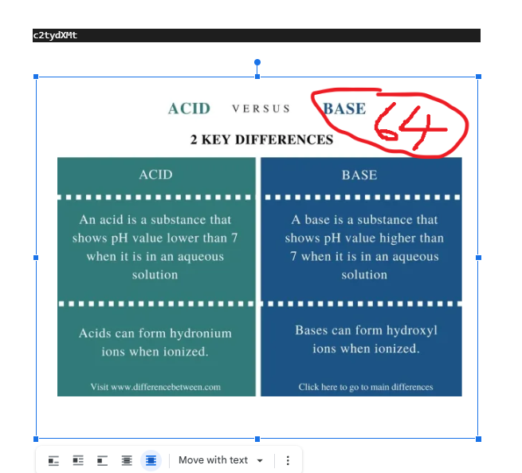

# Getting going (493)

Maldocs bruker som regel exploits eller makroer for å kjøre kode. Dette maldocet bruker en makro.

Makroen kan være obfuskert på forskjellige måter og den kan ha lagret info andre steder.

Zipfilen kan åpnes med passord: "helsectf"

[Getting_going.zip](Getting_going.zip)

# Writeup

Again using `olevba` to dump malicious data. This is the result:


```bash
$ olevba Getting_going.doc 
XLMMacroDeobfuscator: pywin32 is not installed (only is required if you want to use MS Excel)
olevba 0.60.1 on Python 3.10.8 - http://decalage.info/python/oletools
===============================================================================
FILE: Getting_going.doc
Type: OLE
-------------------------------------------------------------------------------
VBA MACRO ThisDocument.cls 
in file: Getting_going.doc - OLE stream: 'Macros/VBA/ThisDocument'
- - - - - - - - - - - - - - - - - - - - - - - - - - - - - - - - - - - - - - - 
(empty macro)
-------------------------------------------------------------------------------
VBA MACRO Module1.bas 
in file: Getting_going.doc - OLE stream: 'Macros/VBA/Module1'
- - - - - - - - - - - - - - - - - - - - - - - - - - - - - - - - - - - - - - - 


    Private Sub Document_Open()\n
    flagg = "aGVsc2VjdGZ7dmFuc2tlbGlnaGV0c2dyYWQt"
    flagg = flagg + ActiveDocument.StoryRanges(1)
    flagg = flagg + "b3BwfQ=="


    End Sub


    
+----------+--------------------+---------------------------------------------+
|Type      |Keyword             |Description                                  |
+----------+--------------------+---------------------------------------------+
|AutoExec  |Document_Open       |Runs when the Word or Publisher document is  |
|          |                    |opened                                       |
|Suspicious|Base64 Strings      |Base64-encoded strings were detected, may be |
|          |                    |used to obfuscate strings (option --decode to|
|          |                    |see all)                                     |
|Base64    |helsectf{vanskelighe|aGVsc2VjdGZ7dmFuc2tlbGlnaGV0c2dyYWQt         |
|String    |tsgrad-             |                                             |
|Base64    |opp}                |b3BwfQ==                                     |
|String    |                    |                                             |
+----------+--------------------+---------------------------------------------+
```

Mising `ActiveDocument.StoryRanges(1)` which seems to fetch something from the word document. Uploading it to Google Docs I can open and see the document, moving the image with a base64 hint shows the missing piece.



Put it all together and base64 decode it to get the flag.

```
aGVsc2VjdGZ7dmFuc2tlbGlnaGV0c2dyYWQt
c2tydXMt
b3BwfQ==
```

# Flag

```
helsectf{vanskelighetsgrad-skrus-opp}
```  