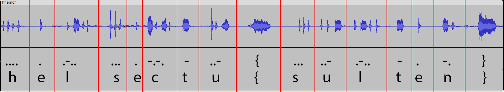

# hønemor (493)

Hønemor har lagt et påskeegg, men har også en beskjed til deg! Klarer du å dekode den?

[hnemor.mp3](hnemor.mp3)

# Writeup

Opened the file in audacity, quickly understood that this is morse. Seeing it visually made it easier to write down.

The code came out to be `helsectu{sulten}` but the flag must be prefixed `helsectf`. So I guessed that and it worked.



# Flag

```
helsectf{sulten}
```