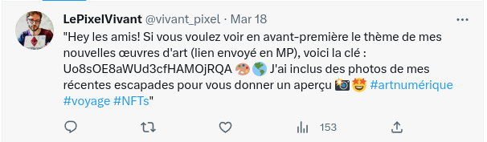

# levende piksel (498)

Påskeharen har fått FOMO og klart å grave seg dypt ned i et kaninhull. På veien ned kom han i kontakt med en levende piksel som sendte han en lenke til kunstverkene sine. "Ne jugez pas un livre à sa couverture" sa pikselen. Påskeharen skjønte ikke helt hva han mente med det, men mistenker han ikke er den eneste som kan ha mottatt lenken. Hva skjuler seg på innsiden mon tro?

# Writeup

This might explain this french dude spamming a mega link in discord: 

> CryptoPixel — Today at 11:15 AM
>
> Salut les amis ! Si vous voulez avoir un aperçu du thème de mes nouvelles œuvres d'art, rendez-vous sur https://mega.nz/folder/3zxlHaCT

With a push towards twitter I finally found that french dude, he revealed the password right there. 



Translates to: 

> Hey friends! If you want to preview the theme of my new artworks (link sent in PM), here's the key: Uo8sOE8aWUd3cfHAMOjRQA 🎨🌎 I've included photos of my recent getaways to give you a preview 📸🤩 #digitalart #travel #NFTs"

Inside this mega link was a `drapeau.txt` (flag in french). 

# Flag

```
helsectf{m1st3nk3lig_lenk3?}
```