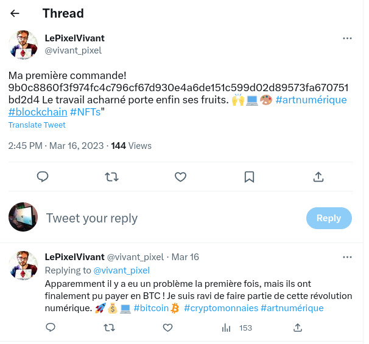

# operasjon vendereis (244)

Påskeharen har dyppet potene sine i krypto, og ha fått kommisjonert seg et kunstverk fra noen på twitter. Dette medførte også at han fikk frisket opp franskkunnskapene sine litt. Det skjedde noe muffens da han først forsøkte å betale. Klarer du å finne ut hva?

# Writeup

Had to get a pointer here, the word `Twitter` came up and I rushed to helsectf to see, and yes. He follows two people. One is a French dude with this tweet:



```
My first order! 9b0c8860f3f974fc4c796cf67d930e4a6de151c599d02d89573fa670751bd2d4 Hard work finally pays off. 🙌💻🎨 #digitalart #blockchain #NFTs"

Apparently there was a problem the first time, but they were finally able to pay in BTC! I am delighted to be part of this digital revolution. 🚀💰💻 #bitcoin #cryptocurrency #digitalart```
```

This matches the first one, using [Blockchain Explorer](https://www.blockchain.com/explorer/transactions/btc/9b0c8860f3f974fc4c796cf67d930e4a6de151c599d02d89573fa670751bd2d4) I found the transaction. But what is there to gain from that. 

I googled how to store a message on a BTC transaction and found [this link](https://blog.trezor.io/creating-permanent-uncensorable-messages-on-the-bitcoin-blockchain-fdbcb229732d). 

```
Users have several options when it comes to storing messages on the Bitcoin blockchain. One method is to use the OP_RETURN feature when sending a transaction. As HackerNoon observes, this essentially makes the bitcoin you’re sending unspendable but allows you to write up to 160 hexadecimal characters. Alternatively, there are methods which involve encoding messages into various output fields such as the PubKeyHash. Some services simplify the process by utilizing these tricks behind the scenes, in order to offer a more user-friendly experience.
```

I remember seeing OP_RETURN once while looking around. And the challenge name kinda has `return` is it, the hint says there was a problem the first time. So I go into the senders wallet of the transaction and find a previous [here](https://www.blockchain.com/explorer/transactions/btc/27a73f2af8e565dddcd55291e216bad593ca26fdcc09d667ad2c4679b104f6d4). Inside that there is a flag on the `OP_RETURN` field.

# Flag

```
helsectf{Sup3r_S3cret_Blockch41n_MSG}
```