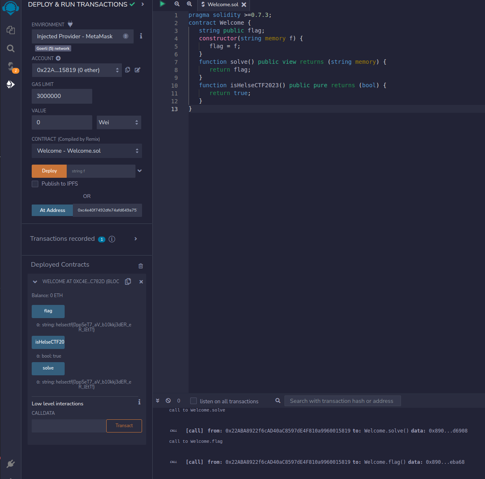

# welcome (500)

pAAskeharen har inngått en smartkontrakt for levering av påskeegg. Dette er selvsagt gjort på den sikreste måten: med blokkjede.

Han har lagret adressen til kontoen i sitt foretrukne kontroll system. For å huske på hvordan smartkontrakter fungerer har han laget en enkel kontrakt med en velkomstmelding.

[Welcome.sol](welcome.sol)

# Writeup

Thinking I need stuff from the [intro/git huskelapp](../../intro/git%20huskelapp/README.md) here. 

```
Jeg har lekt med blokkjeder.
For å lære har jeg kun holdt meg til et ETH testnett.
Haaper jeg ikke har gjort noen feil!
etherum:0xb53449a6cd4D55bD09fD3f4509307139c354cc18
```

Googling a bit it seems like `.sol` is connected to blockchain `Solidity` programming. Youtube shows me a link to run `Smart Contracts`: https://remix.ethereum.org/

Googling for etherium search I find the blockscan and I [search the address](https://blockscan.com/address/0xb53449a6cd4D55bD09fD3f4509307139c354cc18) which shows ma that it has been found in `Goerli Testnet`

Going into that I can see all transactions from that address and there seems to be created 3 `contracts`. One is named [Welcome](https://goerli.etherscan.io/tx/0x0e51070f8cd8875319ccce18a03f03fb6c86b2184afa0b048e1021fbef6b0796) going into that I can see input data, which I also can convert to UTF8, there I can see the flag in cleartext.

But I think that is not how we're supposed to do it. I know now that it is `Goerli` test network.

What I did to be able to run this contract was to find the address the contract was sent to `0xc4e40f7492dfe74afd649a7573ed98d23efc782d`. (From the above link where I just found the flag without using the contract).

Then I setup `Metamask Wallet` on my device, configured it to `Goerli Test Network`, got an address there. and in the `remix` app I now could on `Deploy and Run Transaction` select `MetaMask` as enviroment, which again let me run the contract on the test network.

Then I compiled `Welcome.sol`, selected to run `At Address` and there I could run the functions and see the flag variable. 



# Flag

```
helsectf{0ppSeT7_aV_b10kkj3dER_eR_lEtT!}
```