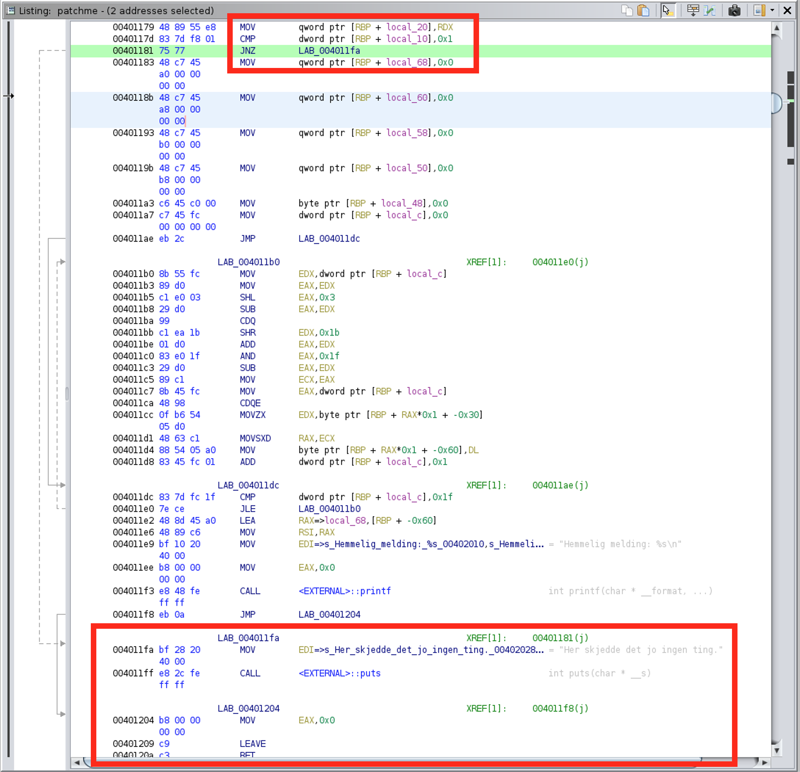

# patchme (488)

Vi har mottatt en binær fil på epost og ønsker å gjøre en analyse. Når vi kjører filen skjer det ingen ting. Vi tror den kan ha en hemmelig melding.

# Writeup

`patchme` name tells me that I have to patch the code, opening it in Ghidra shows main function now showing anything.

```c
undefined8 main(void) {
  puts("Her skjedde det jo ingen ting.");
  return 0;
}
```

Looking at the assembly there is a jump conditions which leads us the assembly looking like the above function. In the middle there is something printing a secret message but that is omitted by the `jnz`.




Changing the `JNZ` to `JZ` makes the main function rebuild like this:

```c
undefined8 main(void) {
  undefined8 local_68;
  undefined8 local_60;
  undefined8 local_58;
  undefined8 local_50;
  undefined local_48;
  undefined8 local_38;
  undefined8 local_30;
  undefined8 local_28;
  undefined8 local_20;
  undefined4 local_10;
  int local_c;
  
  local_10 = 0;
  local_38 = 0x5f4e736e636b6668;
  local_30 = 0x656c5f376e747d56;
  local_28 = 0x65526133636b5f31;
  local_20 = 0x61705f653068657b;
  local_68 = 0;
  local_60 = 0;
  local_58 = 0;
  local_50 = 0;
  local_48 = 0;
  for (local_c = 0; local_c < 0x20; local_c = local_c + 1) {
    *(undefined *)((long)&local_68 + (long)((local_c * 7) % 0x20)) =
         *(undefined *)((long)&local_38 + (long)local_c);
  }
  printf("Hemmelig melding: %s\n",&local_68);
  return 0;
}
```

I really do not need to pretty this up, I can just select `File -> Export` select ELF and save it and re-run it to test this code snippet.

```bash
$ ./patchme_patched
Hemmelig melding: helsectf{eN_3nke1_pa7ch_VaR_n0k}
```

# Flag

```
helsectf{eN_3nke1_pa7ch_VaR_n0k}
```