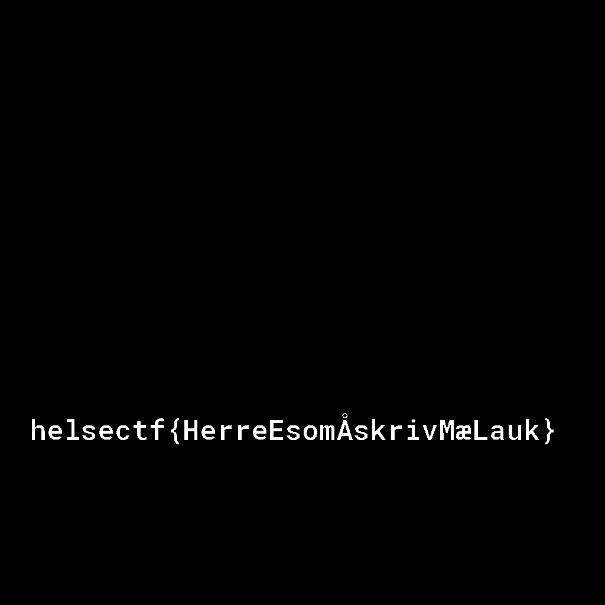

# Ende (500)

Vi har lett i våre pcap arkiver og funnet frem en saftig klassiker fra saken til Erna Trede. Erna var en performance artist som hadde blitt ansatt av sykehusklovnene ved at av våre regionale sykehus.

Vi ble engasjert da man mottok en bekymringsmelding over uvanlig kommunikasjon til klovner i andre land.

Er det noe som tyder på at dette ikke bare er utveksling av kunsterisk verdi? Er det noe man prøver å skjule?

[oppgave1.pcap](oppgave1.pcap)

# Writeup

Found in pcap a http post put request. The request had a PNG and two post fields. 

IExtracted the PNG and opened in [stegonline](https://stegonline.georgeom.net/image). I could not see anything so started digging deeper and digging myself into a hole. Binwalk gave a wierd file `lrzip`

```
file _task1.png.extracted/*
_task1.png.extracted/0:     PNG image data, 1024 x 1024, 8-bit/color RGBA, non-interlaced
_task1.png.extracted/29:    empty
_task1.png.extracted/29-0:  zlib compressed data
_task1.png.extracted/AD431: LRZIP compressed data - version 105.17
```

After digging a whole lot there I asked someone who I knew did this if the `lrzip` was anything and they could not remember. So back on to stegonline, and now I press the channels a bit more, and I see that there is alpha channels aswell. Last time I went through RGB channels but not the alpha. 

Then on bitplane `Alpha 0` i see the flag in clear text.



# Flag

```
helsectf{HerreEsomÅskrivMæLauk}
```