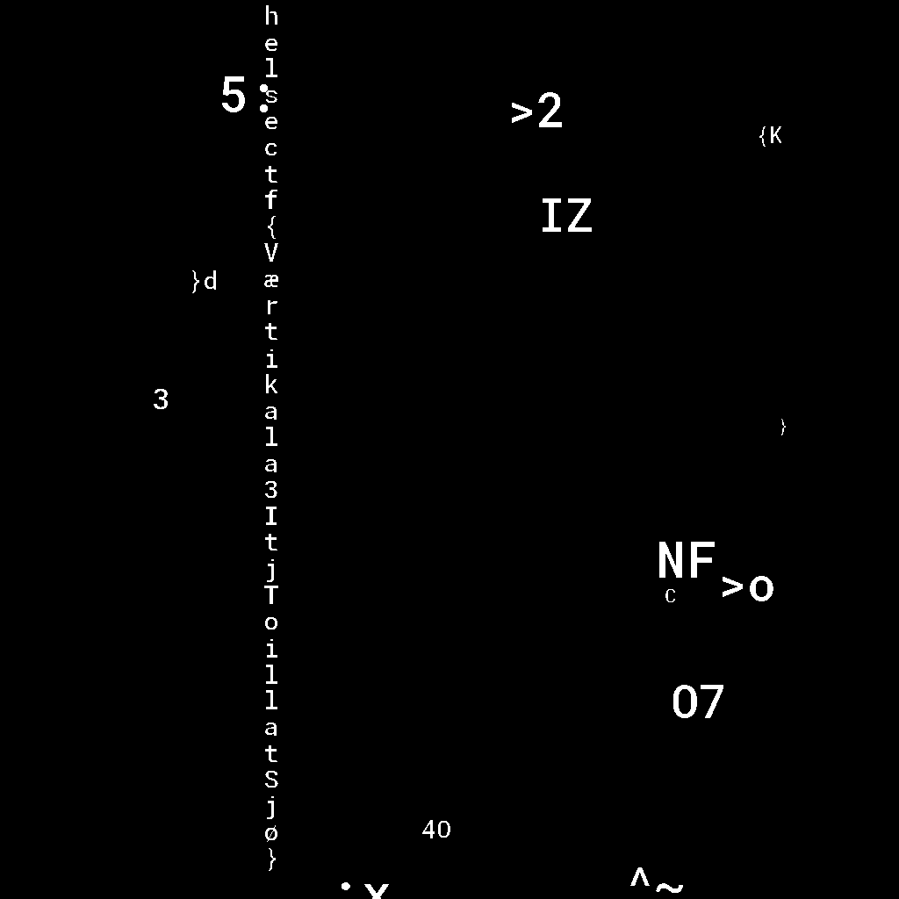

# Tode (488)

Mistanken mot Erna Trede ble bekreftet i oppgave 1. Men noen fikk en en nyss om at vi var på sporet og metodene for å skjule budskapet ble stadig mer sofistikert.

Dette ble et våpenkappløp som vi måtte vinne. Klarer du å holde følge?

[oppgave2.pcap](oppgave2.pcap)

# Writeup

When we knew data was hidden on alpha channel 0 this task was not hard. But each file only shows a few letters. So I open em up and merge them as one file and there we see the vertical flag.



Post request responses, follows, prolly red herring:

```
task2_0 = "Du veit ka du får, med bleika hår"
task2_1 = "Bli itj nå barsk uten karsk"
task2_2 = "Du får itj rota hvis rutan itj e sota"
task2_3 = "Du e itj kar hvis du syns at Tore Strømøy e rar"
task2_4 = "Du e itj rett hvis du kjem fra Klett"
task2_5 = "Det bli itj døll så læng du har øl"
task2_6 = "Du e litt på jorde hvis du digge Tore På Spore"
```


# Flag

```
helsectf{Værtikala3ItjToillatSjø}
```