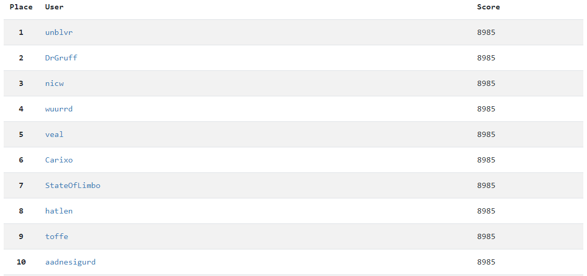
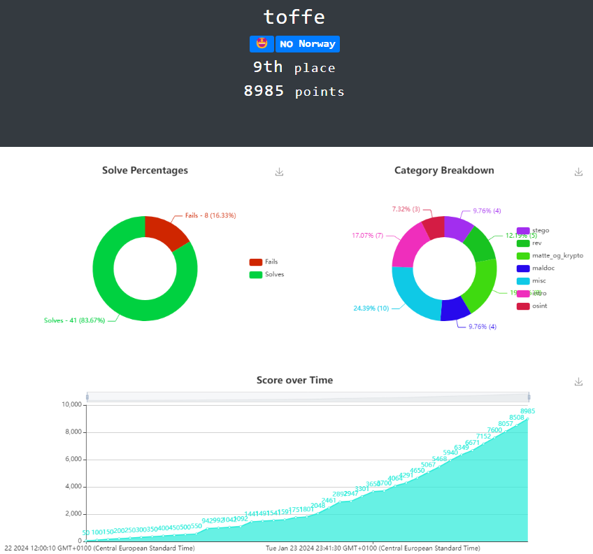

# HelseCTF 2024

Finally a new year, and a new HelseCTF! This year as previous a whole lot of good challenges was on the table. I managed this year to solve all of them. Some I had to ask for a tip and others I nailed on my own. This is my writeup on it.

# Challenges

## matte_og_krypto

- [joppe1](matte_og_krypto/joppe1/README.md)
- [joppe2](matte_og_krypto/joppe2/README.md)
- [joppe3](matte_og_krypto/joppe3/README.md)
- [alder](matte_og_krypto/alder/README.md)
- [reisetid](matte_og_krypto/reisetid/README.md)
- [Larsw sekvens](matte_og_krypto/Larsw%20sekvens/README.md)
- [bokstavkrypto](matte_og_krypto/bokstavkrypto/README.md)

## stego

- [image processing 1](stego/image%20processing%201/README.md)
- [image processing 2](stego/image%20processing%202/README.md)
- [prikker](stego/prikker/README.md)
- [zellweger](stego/zellweger/README.md)

## rev

- [babyrev_fortran](rev/babyrev_fortran/README.md)
- [babyrev_rust](rev/babyrev_rust/README.md)
- [StateOfGo](rev/StateOfGo/README.md)
- [Seksjoneringsavdelingsdirektør Gustavsen](rev/Seksjoneringsavdelingsdirektør%20Gustavsen/README.md)
- [debug_rat](rev/debug_rat/README.md)

## misc

- [Skalerbar vektorgrafikk](misc/Skalerbar%20vektorgrafikk/README.md)
- [tetris1](misc/tetris1/README.md)
- [tetris2](misc/tetris2/README.md)
- [tetris3](misc/tetris3/README.md)
- [tetris4](misc/tetris4/README.md)
- [null pointer](misc/null%20pointer/README.md)
- [bombzip2](misc/bombzip2/README.md)
- [Rocky Balboa](misc/Rocky%20Balboa/README.md)
- [not cipher](misc/not%20cipher/README.md)
- [short not cipher](misc/short%20not%20cipher/README.md)

## maldoc

- [easy_flag](maldoc/easy_flag/README.md)
- [hidden](maldoc/hidden/README.md)
- [Claim_in_mail](maldoc/Claim_in_mail/README.md)
- [Pass or fail?](maldoc/Pass%20or%20fail/README.md)

## intro

- [remote](intro/remote/README.md)
- [dcode.fr](intro/dcode.fr/README.md)
- [discord](intro/discord/README.md)
- [konvertere](intro/konvertere/README.md)
- [Hacker](intro/Hacker/README.md)
- [Koder](intro/Koder/README.md)
- [Kyberkriger](intro/Kyberkriger/README.md)

## osint

- [mastodon](osint/mastodon/README.md)
- [unike domenenavn](osint/unike%20domenenavn/README.md)
- [fallskjermhopper](osint/fallskjermhopper/README.md)

# Scores

