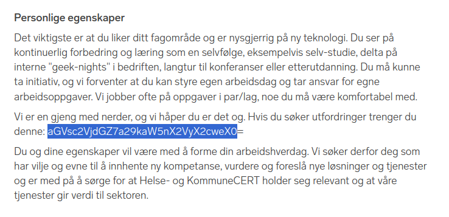

# Koder

Liker du å skrive kode? Er du en nørd med sære interesser for god kode og onelines? Er du lei av at koden din ikke brukes til noe viktig? Vi i Helse- og KommuneCERT ønsker å styrke vårt engineering-team med en eller flere fullstack utviklere. Du vil være med å utvikle løsninger som har stor indirekte samfunnsmessig effekt! For å vite mer kan du lete etter flagg her:

https://www.finn.no/job/fulltime/ad.html?finnkode=336881415

# Writeup

Their job listing had a base64 encoded flag in it. 



I used base64 to decode it:

```bash
$ echo aGVsc2VjdGZ7a29kaW5nX2VyX2cweX0= | base64 -d
helsectf{koding_er_g0y}
```


# Flag

```
helsectf{koding_er_g0y}
```