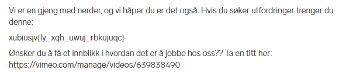

# Kyberkriger

Lyst til å være med å avsløre og hindre cyberangrep mot Norge? Vi er på jakt etter dedikerte individer som ønsker å være med på å gjøre internett tryggere. Vår jobb har en betydelig indirekte samfunnsmessig innvirkning som også strekker seg utover helse- og kommunalsektor. Stillingen og mer info finner du her:

https://www.finn.no/job/fulltime/ad.html?finnkode=336880773

# Writeup

Found this on their job listing:



Seems like rotated text. I used [CyberChef](https://gchq.github.io/CyberChef/#recipe=ROT13(true,true,false,10)&input=eHViaXVzanZ7bHlfeHFoX3V3dWpfcmJrdWp1cWN9) to decode it and just bruted the number. It was rotated 10 times.

# Flag

```
helsectf{vi_har_eget_blueteam}
```
