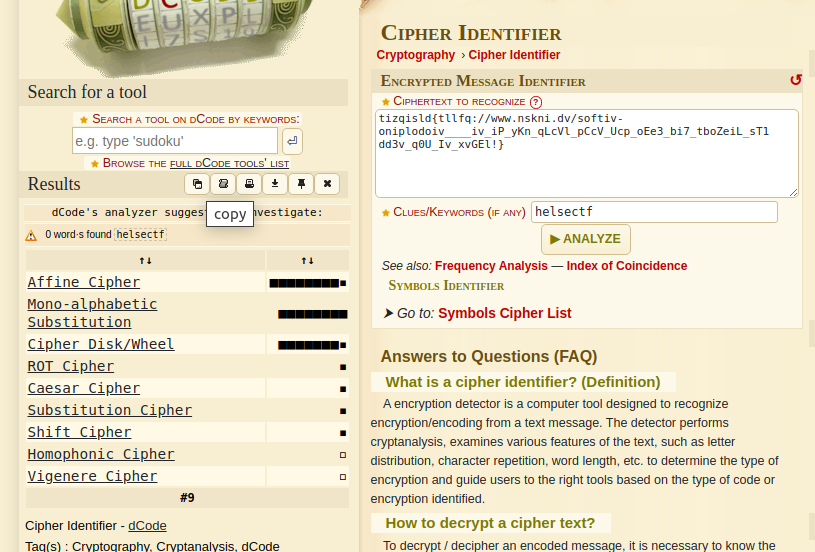
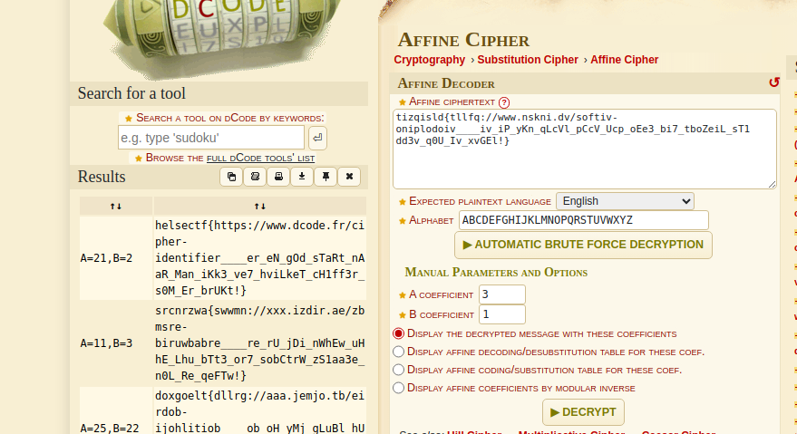

# dcode.fr

Mattenerden Affinis Finé valgte sitt favoritt monoalfabetisk substitusjonschiffer som hen fant på nettsiden http://dcode.fr for å skjule et flagg.

Tips! Når man møter på krypto-oppgaver med ukjent algoritme så finnes det online tjenester for å identifisere hvilket cipher det er gitt chifferteksten.

Kan du med dette krypterte flagget finne tilbake til klarteksten? Den følger formatet helsectf{ ... } og den kan vi se i strukturen under.

```
tizqisld{tllfq://www.nskni.dv/softiv-oniplodoiv____iv_iP_yKn_qLcVl_pCcV_Ucp_oEe3_bi7_tboZeiL_sT1dd3v_q0U_Iv_xvGEl!}
```

# Writeup

Quickly went to the cipher identifier on dcode.fr and pasted the cipher text. It was identified as a `Affine Cipher` as hinted to in the description.



From there I could just press the link paste the cipher text and get the flag. I added helsectf as a clue to help it identify the cipher.




# Flag

```
helsectf{https://www.dcode.fr/cipher-identifier____er_eN_gOd_sTaRt_nAaR_Man_iKk3_ve7_hviLkeT_cH1ff3r_s0M_Er_brUKt!}
```