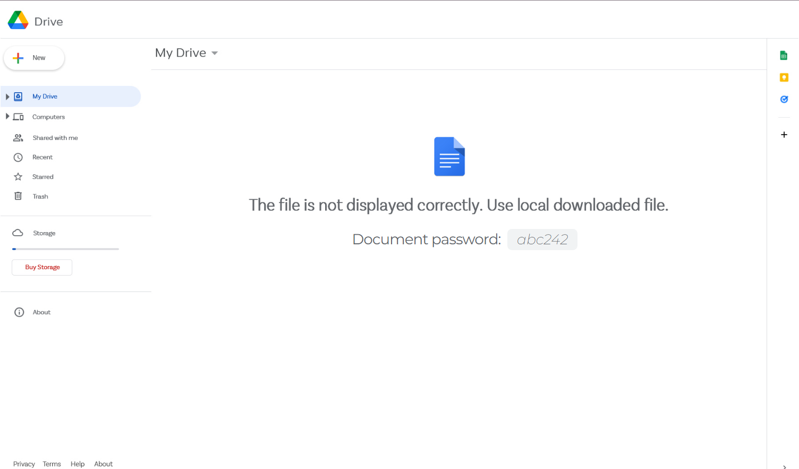
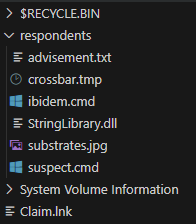

# Claim_in_mail

Du har fått en e-post med et html-vedlegg. Det er vel bare å åpne det?

Tips: Nøst opp i angrepskjeden. Finn ut hva den forsøker å kjøre. Målet er å finne siste tilgjengelig steg i kjeden.

I god stil er oppgavefilen pakket i en kryptert zip. (passord infected)

[⬇️ Oppgave.zip](Oppgave.zip)

# Writeup

I disabled javascript and opened the file in a dedicated browser to investigate what we see.



Clearly a phising attack. Lets see if we can find anything interesting in the source code.

I immidiately found a whole lot of base64 but lets start with the `<script>` tag as that is the first place something might run without our input. And breaking this down we see:

```javascript
// This is basically just `body` with some extra steps
let qtlp9XHO = document.querySelector("#uTNo9PZ1"); 

// This is the `mousemove` event listener on body
// so when we move the mouse this function will be called
qtlp9XHO.addEventListener("mousemove", (e) => { 

    // This creates a element and appends to the body if not already exists.
    if (!document.getElementById('tgTEDEOi')) {
        const iARDJsgm = document.createElement("div");

        var RqzjVpL3 = document.createElement("embed");
        
        RqzjVpL3.setAttribute("width", 40);
        RqzjVpL3.setAttribute("height", 10);
        RqzjVpL3.setAttribute("id", "tgTEDEOi");
        // Now this is the next part that is interesting
        // Lets remember this when we get down there that the
        // content of this will be added to the DOM.
        RqzjVpL3.setAttribute("src", iFyL046D());
        
        document.body.appendChild(iARDJsgm);
        iARDJsgm.appendChild(RqzjVpL3);
    }
});

// This function is just a split function. 
// The function does nothing it returns the input with .split("").
// "abc" => ["a", "b", "c"]
function wgn6tuxF(Fv81kaq4) {
    let Nq9OZiAb = "";
    let PoMly4D7 = Fv81kaq4.split("");
    
    for (var i = Fv81kaq4.length - 1; i >= 0; i--) {
        Nq9OZiAb += Fv81kaq4[i];
    }
    return PoMly4D7;
}

// This uses the split function and reverses the input. 
// ['a', 'b', 'c'] => ['c', 'b', 'a'].
function dwXkgFDp(a)
{
    return wgn6tuxF(a).reverse();
}

// Now, this is the interesting part which adds to the DOM
// once the mouse is moved:
function iFyL046D()
{
    // Thhis finds the data-string-data attribute on the element with id gVLtcD0F
    // That value is a base64 string. It 
    let VPm7WSM2 = document.querySelector("#gVLtcD0F").dataset.stringData;
    // This is a prefix for a Data URI
    // (https://developer.mozilla.org/en-US/docs/Web/HTTP/Basics_of_HTTP/Data_URIs)
    let Fv81kaq4 = "data:image/svg+xml;base64,";
    // This takes the base64 string and runs it thought the simple split and reverse
    // before re-joining them here.
    Fv81kaq4 += dwXkgFDp(VPm7WSM2).join("");
    // Then it does the same with TrDtn6pn's innerhtml. 
    Fv81kaq4 += dwXkgFDp(document.getElementById('TrDtn6pn').innerText).join("");

    // Then that is returned added to the EMBED element created on mouse move.
    return Fv81kaq4;
}
```

So I've extracted the base64 data from the function and innerText reversed both and joined them. That gave me [this](embed_source.txt) which when decoded gave me a [SVG file](embed_source.svg).

Inside the SVG there is more scripts which are executed once it is shown. I'm not analyzing these too much as I'm not sure if they are relevant. But I did find a base64 string which when decoded gave me a [zip file](embed_source.zip).

Also quickly analyzing this file you see that it is a wrapper to create a download of a file. I'm guessing this is a bypass method to get your browser to download without asking? I'm not quite sure. Anyways this is the same file as the one we got from the browser when moving the mouse on a script enabled window.

The zip file seems to require a password, the password is the same as the one shown on the phising site: `abc242`. This gives me a `vhd` file which is a virtual harddrive. 

```bash
$ file Claim_3456.vhd 
Claim_3456.vhd: DOS/MBR boot sector MS-MBR Windows 7 english at offset 0x163 "Invalid partition table" at offset 0x17b "Error loading operating system" at offset 0x19a "Missing operating system", disk signature 0x23ebd659; partition 1 : ID=0xe, start-CHS (0x80,0,1), end-CHS (0x3ff,0,1), startsector 128, 6144 sectors
```

I'm not sure how to mount this in linux so I just used `7z` to extract the files.

```bash
7z x *.vhd -o./disk/
```



first there is Claim.ink which could look like a claim file. Runs `ibidem.cmd` from respondents.

Inside the disk folder there are a `respondents` folder with 2 cmd files. These contains batch scripts. So the first one `ibidem.cmd` seems to call `suspect.cmd` so lets parse what `ibidem.cmd` does.

First I run the 4 commands in that in my cmd terminal. Then I echo the 5th to see what all resolves to:

```
start /min respondents\suspect.cmd system star exe
```

So on `suspect.cmd` i do the same

```
replace C:\WINDOWS\\%132\\%2r32.exe C:\Users\THORLE~1\AppData\Local\Temp /A
ren espondents\\crossbar..tmp respondents\\crossbar.%3'
call %2t respondents\\crossbar.%3,"run"
```

%2 %3 is replaces with the parameters given in the first file (star, system, exec) so lets do that manually.

```
replace C:\WINDOWS\\system32\\starr32.exe C:\Users\THORLE~1\AppData\Local\Temp /A
ren espondents\\crossbar..tmp respondents\\crossbar.exe'
call start respondents\\crossbar.exe,"run"
```

Guessing it says `starr32.exe` instead of `start32` to spare some who is running these files as this is only educational?

I try to Ghidra on both the crossbar and dll file in the folder but I dont understand anything. Asking for a tip on how to reverse these I am told to use [dnSpy](https://github.com/dnSpy/dnSpy). Then I opened both files and imidiately see that the `StringLibrary.dll` is the interesting one.

```c
using System;
using System.Runtime.CompilerServices;
using System.Threading;
using RGiesecke.DllExport;

// Token: 0x02000002 RID: 2
public class HelseCTF
{
	// Token: 0x06000001 RID: 1 RVA: 0x00002050 File Offset: 0x00000250
	[NullableContext(1)]
	[DllExport]
	public static void Main(string[] input)
	{
		bool flag = input[0] == "run";
		if (flag)
		{
			Console.Write("Here I would normally run malware. Since this is a CTF I shall abstain");
			Thread.Sleep(50);
			Environment.Exit(0);
		}
		bool flag2 = input[0] == "giefKey";
		if (flag2)
		{
			Console.Write(b64decode.b64_decode("DAEIFwEHEAIfDQI7DRA7FQUPFzsIDQ8BOwU7BgsQO1IBBgBTAVxSAgVRBVxWAgZUUlZcVFQCXVFWXQIBAAFQVFYFBlAGU1FcUFFXAQFVUFFSVV1TU1FQBwVUUVVVUFEZ", 5));
			Thread.Sleep(500);
			Environment.Exit(0);
		}
		else
		{
			Console.Write("That is not the input I am looking for");
		}
	}
}
```

That base64_decode command looks like this:

```c
using System;
using System.Runtime.CompilerServices;
using System.Text;

// Token: 0x02000003 RID: 3
internal class b64decode
{
	// Token: 0x06000003 RID: 3 RVA: 0x000020DC File Offset: 0x000002DC
	[NullableContext(1)]
	public static string b64_decode(string A_0, int A_1)
	{
		byte[] array = Convert.FromBase64String(A_0);
		int num = (A_1 * 2686 + 1432990190) % 256;
		for (int i = 0; i < array.Length; i++)
		{
			byte[] array2 = array;
			int num2 = i;
			byte[] array3 = array2;
			int num3 = num2;
			array3[num3] ^= (byte)num;
		}
		return Encoding.UTF8.GetString(array);
	}
}
```

So it decodes, then xor's it with a number. The `A_1` is 5 so the number is easy to calculate to `100`. Then I opened [CyberChef](https://gchq.github.io/CyberChef/#recipe=From_Base64('A-Za-z0-9%2B/%3D',true,false)XOR(%7B'option':'Decimal','string':'100'%7D,'Standard',false)&input=REFFSUZ3RUhFQUlmRFFJN0RSQTdGUVVQRnpzSURROEJPd1U3QmdzUU8xSUJCZ0JUQVZ4U0FnVlJCVnhXQWdaVVVsWmNWRlFDWFZGV1hRSUJBQUZRVkZZRkJsQUdVMUZjVUZGWEFRRlZVRkZTVlYxVFUxRlFCd1ZVVVZWVlVGRVo) and got the flag.

# Flag

```
helsectf{if_it_qaks_like_a_bot_6ebd7e86fa5a82fb062800f9529fede402ab4b758453ee1456197754ca051145}
```