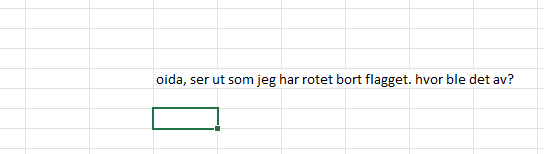
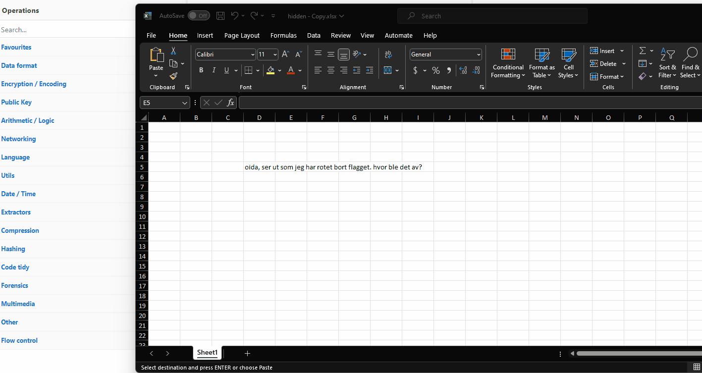

# hidden

Enda et Excel-ark! Men denne gangen fant vi ingen macroer... Men hvor er flagget?

I god stil er oppgavefilen pakket i en kryptert zip. (passord infected)

[⬇️ hidden.zip](hidden.zip)

# Writeup

It talks about hidden so I investigate the file with `olevba` but it did not find anything. It wont open in my excel but I renamed it to xlsx and it opened.



It talks about something lost. I unhide rows and columns and then I unhide sheets, there it was. 



[CyberChef link](https://gchq.github.io/CyberChef/#recipe=From_Base64('A-Za-z0-9%2B/%3D',true,false)&input=YUdWc2MyVmpkR1o3ZFhONWJteHBaMTloY21zaGZRPT0NCg)

# Flag

```
helsectf{usynlig_ark!}
```

