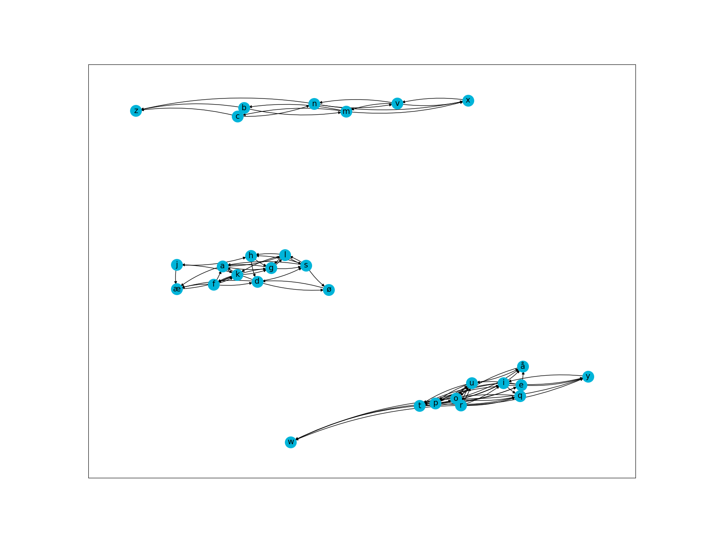
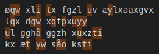
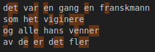

# bokstavkrypto

Analyseavdelingen har fanget opp en klartekst med tilhørende chiffertekst, men det siste avsnittet av klarteksten mangler.

Alle de uavhengige kryptografene våre insisterer på at det er viginere-cipher som er brukt, og vi stoler på dem, men vi kan ikke skjønne hvordan de kan ha rett.

Analyseavdelingen mangler kapasitet til å se på dette, og håper du har tid. De foreslår at du analyserer de første avsnittene, så skal du greie å dekryptere den siste delen.

[⬇️ klartekst.txt ](./klartekst.txt) 

[⬇️ chiffertekst.txt ](./chiffertekst.txt)

Hint: [⬇️ bokstavkrypto_piler_og_baner.png ](./bokstavkrypto_piler_og_baner.png)

# Writeup

First check on this was to see that it was not a default Vigenere cipher. If it was we could use a few bytes from the cleartext and cipher text to recreate the key. 

The cleartext had some hints in it which I could not connect at all. I deemed this impossible for now and wanted to wait until I did everything else. Then we got the `hint`. A lot of people was solving it. So based on this I also opened the hint and tried to solve it.  

The hint was based on paragraph 2 in the cleartext.



Someone I talked to mentioned that the letters on the image was 7, 11, 11 and the groups was containing the lettes only for the rows on the norwegian keyboard: `qwertyuiopå` and `asdfghjkløæ` and `zxcvbnm`. 

This got us both to think about the keyboard layout. I then started to use the keyboard layout as a key. But could not find a way to do this. Then I got a moment of realization. What if the alphabet is the keyboard row, and we need to only do letters from that row first?

Then I tried manually reversing the key by using the keyboard layout rows as alphabet. I created a [table.py](./table.py) when run creates a Vigenere table for me with the top row on the keyboard as the alphabet.

```bash
$ python3 table.py qwertyuiopå
--------------------------------------------
| q | w | e | r | t | y | u | i | o | p | å | 
--------------------------------------------
| w | e | r | t | y | u | i | o | p | å | q | 
--------------------------------------------
| e | r | t | y | u | i | o | p | å | q | w | 
--------------------------------------------
| r | t | y | u | i | o | p | å | q | w | e | 
--------------------------------------------
| t | y | u | i | o | p | å | q | w | e | r | 
--------------------------------------------
| y | u | i | o | p | å | q | w | e | r | t | 
--------------------------------------------
| u | i | o | p | å | q | w | e | r | t | y | 
--------------------------------------------
| i | o | p | å | q | w | e | r | t | y | u | 
--------------------------------------------
| o | p | å | q | w | e | r | t | y | u | i | 
--------------------------------------------
| p | å | q | w | e | r | t | y | u | i | o | 
--------------------------------------------
| å | q | w | e | r | t | y | u | i | o | p | 
--------------------------------------------
```

 

As we had the cleartext and the ciphertext I could try to reverse the key. 

```
Q = E = P
W = T = O
I = R = T
T = E = E
U = E = T
Y = R = E
Q = O = R
```

First I thought I had "POTTER" but after some trial and error while making a script I saw it was `POTETER`. I now had the solution.

So I mocked up [solve.js](./solve.js) and got the last paragraph decoded.  Not the cleanest code but it got the job done

```
proin ornare enim elit, helsectf{duklartedet-facbaeeddefbbdaa} sit amet dapibus nisi convallis 
```

There the flag was!

The keys were: `poteter` for `qwertyuiopå`, `klægg` for `asdfghjkløæ` and `nvc` for `zxcvbnm`

# Flag

```
helsectf{duklartedet-facbaeeddefbbdaa}
```