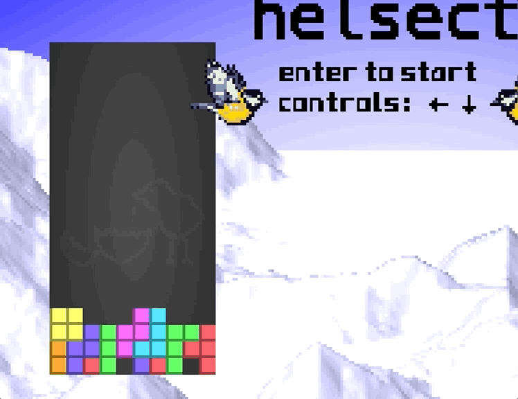

# tetris2

Før du starter spillet står det hvilke taster som kan brukes for å styre spillet. Én av tastene er ikke listet og gir uante muligheter. Bruk tasten mye og få et flagg.

# Writeup

Looking at the source there is something happening on keypress up

```html
if (e.code == "ArrowUp" && beenBelow) {
    if (currentY > -3) { currentY -= 1; drawFrame(frame); }
    else { state[38] = state[39] = state[40] = 40 + currentX * 6; state[41] = currentTetro; state[42] = currentRot; newTetro();}
}
```

`beenBelow` seems to be true when a piece is below a given height. So when pressing up after it has nearly hit bottom you get a flag.




# Flag

```
helsectf{meisebolle}
```