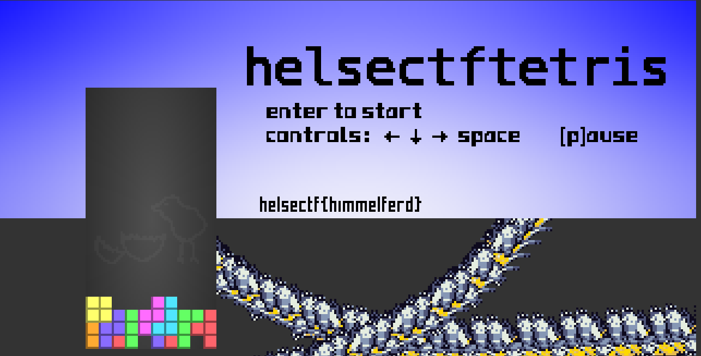

# tetris3

Nede i horisonten, under fjell, snø og terreng ligger det et flagg.

# Writeup

Seems like I should hide the background? First I prettified the html file [tetris.html](tetris.html) and found this:

```javascript
function drawTerrain($) {
    let J = 0;
    frame % 768 > 640 && (J = 384 - (frame % 768 - 640) * 3);
    for (let _ = 0; _ < 400; _++) {
        u2 = _ + J;
        for (let N = 0; N < width; N++) {
            var e = mheight(N / width * 150, u2 / 1.5)
            , t = mnormal(N / width * 150, u2 / 1.5)
            , H = normalize([-Math.sin(lines / 30 + .6), Math.cos(lines / 30 + .6), 1.414])
            , A = dot(t, H);
            A = 150 + 120 * A;
            let r = 120 - Math.round(70 * e + 20) + Math.round(.4 * _);
            for (v = 0; v < 3; v++)
                setPixel($, N, r + v, A, A, 1.2 * A)
        }
        i = x
    }
    if (state[0] > 4) {
        for (let X = 0; X < 20; X++)
            for (let o = 0; o < 140; o++)
                setPixel($, o + 130, X + 140, 192, 240, 192);
        i($, 140, 145, state[99]),
        drawTerrain.a || (drawTerrain.a = 2),
        i($, 197, 145, y(brd1[0].substring(269))),
        i($, 254, 145, state[98])
    }
}
```

The challenge says that behinnd the mountains there is a flag. So I guess I need to hide the mountains. I tried to remove the `drawTerrain` by adding a return in the start and there it was.



# Flag

```
helsectf{himmelferd}
```