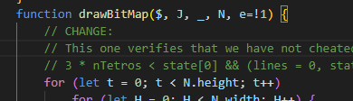
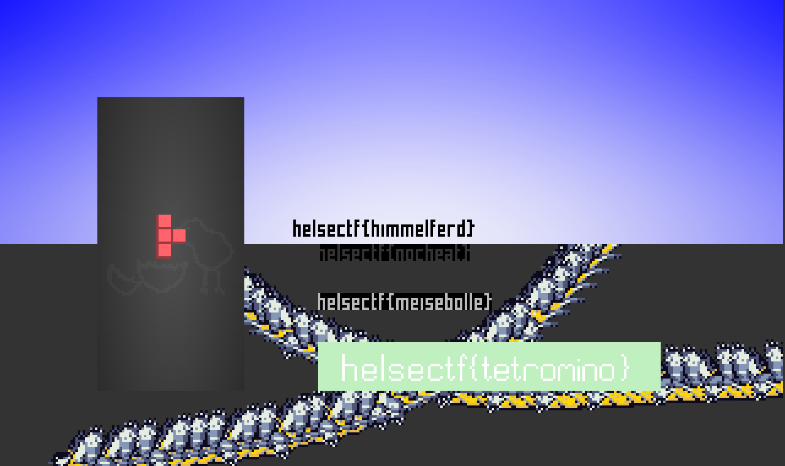

# tetris4

Spill til du har fått renska 5000 linjer på brettet.

# Writeup

I refuse to play 5k lines on this there must be a way around it. Again modifying the prettified [tetris.html](tetris.html) file I found this:

```javascript
else if (currentMode == "GAMEOVER" || currentMode == "WELCOME") {
    if (e.code == "Enter") {
        currentMode = "TETRIS";
        board = [];
        for (let i = 0; i < 20; i++) {
            board.push([0, 0, 0, 0, 0, 0, 0, 0, 0, 0]);
        }
        lines = 9999;
        state[0] = 9999;
        nTetros = 9999;
        newTetro();
        startTimer();
    }
}
``` 

This is where it sets the lines when you start to zero. I changed them to `9999` but that put me as a cheater. Quickly I found out where it used this `state[0]` on this line:

```javascript
function drawBitMap($, J, _, N, e=!1) {
    // -- BELOW HERE --
    3 * nTetros < state[0] && (lines = 0, state[0] = 0, currentMode = "X");
    // -- ABOVE HERE --
    for (let t = 0; t < N.height; t++)
        for (let H = 0; H < N.width; H++) {
            fx = e ? N.width - H - 1 : H;
            var A = N.pixels[t * N.width + fx];
            A != N.transColor && setPixel($, H + J, t + _, ...N.palette[A])
        }
}
```
A sneaky if check on the first line of this verifies the variables to not be cheated with in some way. So I just commented that out and I got all the flags I needed.


# Flag

```
helsectf{nocheat}
```

# Extra

I had to get all flags visible so I've modified the [tetris.html](tetris.html) file to show all flags at once. I've added a comment with `CHANGE:` on the lines I've changed in the [tetris.html](tetris.html) file.



So this was the outcome of that:



To get all flags you need to 

1. start the game. 
2. press up when a tetromino is at the bottom until it is above the board.