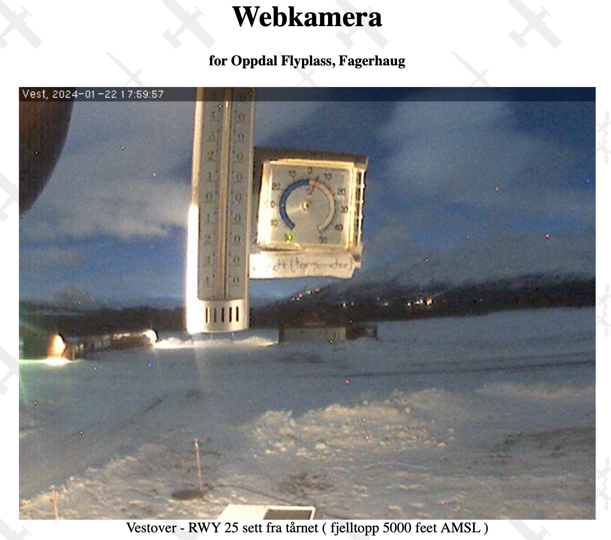
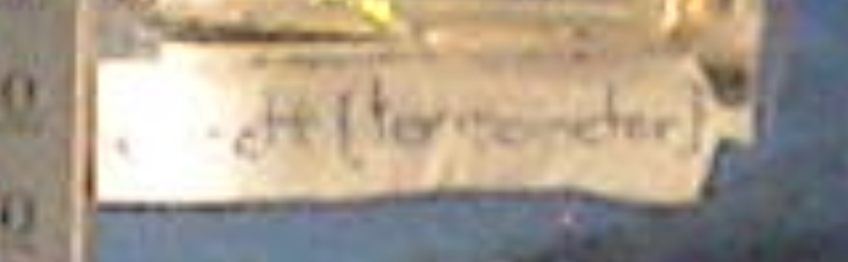

# fallskjermhopper

En fallskjermhopper hadde en papirlapp i lomma da hun hoppet ut av et fly i nærheten av Oppdal. Lappen har falt ut av lomma, men opptil flere fugler har hvisket til henne at den landet i nærheten av et kamera. Kan du se om du finner den? OBS: Lysforhold kan gjøre lappen være litt vanskelig å lese. Men du har mer enn 1000 forsøk, og får ingen straff for å svare feil.

# Writeup

As this is osint my first thought was to look for web cameras. Found few links

https://www.meteoblue.com/en/weather/webcams/oppdal_norway_3143513
https://www.oppdalskisenter.no/kopi-av-v%C3%A6r-og-f%C3%B8re

Then I thought about airport since it was a skydiver from a plane. Found this URL

http://www.mfl.no/webcam.html

Nothing I could see easily at daytime. Took a break and waited a few hours and at night time is was a lot more readable.




Could clearly see the "ctf" and brackets. Then inside I see `ter` and `eter`.. As this is a thermometer the norwegian word is also `termometer`so the flag was:

# Flag

```
helsectf{termometer}
```
