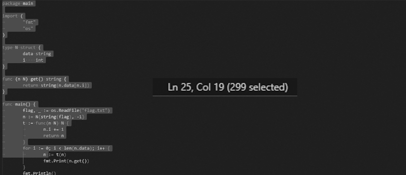

# StateOfGo

Mitt Go-program kompilerer fint, men viser ikke flagget? Jeg som trodde Go aldri kunne gjøre noe feil!? Se om det hjelper å overskrive en byte på vilkårlig offset.

from pwn import *
io = remote("helsectf2024-2da207d37b091b1b4dff-stateofgo.chals.io", 443, ssl=True)
io.interactive()

[⬇ server.py](./server.py)

# Writeup

This is what I saw when connecting to the server:

```go
Mitt Go program kompilerer fint, men viser ikke flagget? Jeg som trodde Go aldri kunne gjøre noe feil!?

------------
package main

import (
        "fmt"
        "os"
)

type N struct {
        data string
        i    int
}

func (n N) get() string {
        return string(n.data[n.i])
}

func main() {
        flag, _ := os.ReadFile("flag.txt")
        n := N{string(flag), -1}
        t := func(n N) N {
                n.i += 1
                return n
        }
        for i := 0; i < len(n.data); i++ {
                n := t(n)
                fmt.Print(n.get())
        }
        fmt.Println()
}
------------
result:hhhhhhhhhhhhhhhhhhhhhhhhhhhhhhhhhhhhhhhhhhhhhhhhhhhhhhh

offset (decimal)?> 
``` 

So I copied that and ran it locally and it seems like it is repeating the first character. And according to [server.py](server.py) the offset allows me to modify this script by 1 character. I searched a while and tested a few things without removing a character here and there until I removed the `:` from `n: t(n)` and then it worked.

So used vscode to find the offset 



Then I sent the `299` offset and hex `20` (space) to the server and got the flag.

After checking this out it seems like using `:=` is creating a new local variable within the for loop copying the original `n` with -1 as value. Then it increments it every time from -1 to 0 which gets the first letter. Using `=` will reuse the original `n` and increment it from -1 to 0 to 1 to 2 and so on.

# Flag

```
helsectf{redeclaring_a_Go_variable_can_shadow_another!}
```