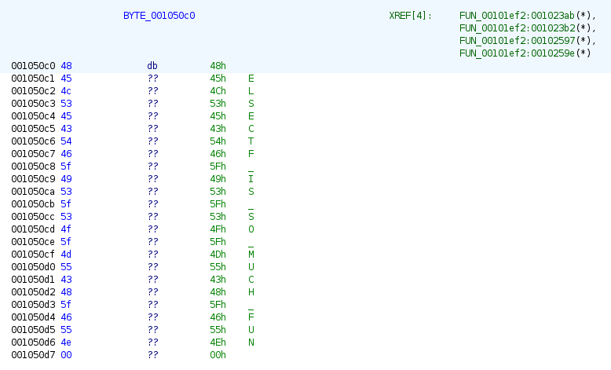

# debug_rat

En god RAT går aldri av moten! Vi har deployet en test, men glemte å slå av feilsøkingsgrensesnittet og andre skjulte kommandoer.

Kan du ta kontrollen på råtta og se om det er mulig å få ut flagget som ligger lagret på /flag.txt?

PS! Binarien er en fult fungerende Remote Access Trojan som gir Remote Code Execution. I god stil er derfor oppgavefilen pakket i en kryptert zip. (passord: infected)

```python
from pwn import *
io = remote("helsectf2024-2da207d37b091b1b4dff-debug-rat.chals.io", 443, ssl=True)
io.interactive()
```

[⬇ debug_rat.zip](./debug_rat.zip)

# Writeup

I start by opening the binary with Ghidra and find the main function. I find out the function which receives the commands we write which seems to be the main function here: [FUN_00101ef2](./sources/FUN_00101ef2.c). It captures the input on [Line 92](./sources/FUN_00101ef2.c#L92) into variable `local_4c8` and calculates total input length to `local_588`.

After a bit of analyzing I see the programs has a few commands we can check out:

- [Line 104](./sources/FUN_00101ef2.c#L104) - checks for `HINT`
- [Line 115](./sources/FUN_00101ef2.c#L115) - checks for `CAT` 
- [Line 133](./sources/FUN_00101ef2.c#L133) - does something with the input and checks for the result.
- [Line 160](./sources/FUN_00101ef2.c#L160) - checks for 6 characters and none of them are null bytes
- [Line 166](./sources/FUN_00101ef2.c#L166) - checks for `EXEC`

## Lets start with HINT

```
> HINT
you will not find the whole flag here!
try harder
```

Depressing.. Lets move on!

## Lets analyze CAT

If I write `CAT` it prints a random cat line. Then there is an extra check on [line 125](./sources/FUN_00101ef2.c#L125) if the length is 8, then after cat a space + 1337. That sets `local_584` to 3. The cat lines only have 0-2 lines so this does some magic which seems to trigger the `_INIT_3()` which prints [cat_ascii.txt](./sources/cat_ascii.txt).

Then I get this:

```
    /\___/\
   /       \
  l  u   u  l
--l----*----l--
   \   w   /     - Meow!
     ======
   /       \ __    
   l        l\ \   
   l        l/ /   flag part1 is:
   l  l l   l /    helsectf{r3meMber_
   \ ml lm /_/
```

A bit more uplifting.

## Lets analyze the unknown check

I then start to look at the unknown check on [line 133](./sources/FUN_00101ef2.c#L133). It seems to do some magic on the input then runs this comparison which seems to expect 5 characters.

```c
FUN_00101986(local_4c8,(undefined *)((long)&stack0xfffffffffffffae0 + 3),5);
if ((4 < local_588) && (iVar3 = strncmp((char *)((long)&stack0xfffffffffffffae0 + 3),&DAT_001050d8,5), iVar3 == 0))
```

The function `FUN_00101986` modifies my inut and puts it into the address of `&stack0xfffffffffffffae0 + 3`. Then it compares 5 bytes with `DAT_001050d8`. Looking at `DATA_001050d8` in ghidra I see this:


It is 5 `A`'s. But that does not work, but as you see on the refs for it it reads and writes to it in the `FUN_00101663`. In there we see 

```c
void FUN_00101663(void) {
  if ((char)_DAT_001050d8 == 'A') {
    _DAT_001050d8 = 0x46435244;
    DAT_001050dc = 0x47;
  }
  return;
}                           
```

Now I tried a whole lot to make sens out of this. I might have missed something but I tried to run it in ida with debug point at the if statement. Then I see the value is a bit different than what this function shows.


Converting this `4434425547` to ascii gives `DEBUG`. So to enter this function we just write DEBUG. 

Then continuing down this if statement [line 146](./sources/FUN_00101ef2.c#L146) it checks that the total length of the input is 38. Then continues to run [FUN_00101840](./sources/FUN_00101840.c) which is a `xor` function on the 32 last characters. It `xor` against the key `HELSECTF_IS_SO_MUCH_FUN\x00` then stores that into `DAT_00105380`. The important thing is to remember the nullbyte. Ghidra shows the string when going to that address but right click -> set data type as bytes shows this:



And we see it uses 0x18 which is 24 bytes. The text `HELSECTF_IS_SO_MUCH_FUN` is 23 bytes. So the last byte is the nullbyte. 

```
> DEBUG XXXXXXXXXXXXXXXXXXXXXXXXXXXXXXXX
TODO: remove DEBUG interface to prevent SECRET key overwrite

OK SECRET overwrite
> 
```

So this writes `XXXXXXXXXXXXXXXXXXXXXXXXXXXXXXXX` XOR'ed with `HELSECTF_IS_SO_MUCH_FUN\x00` into `DAT_00105380`. This seems to be used later on in the `EXEC` command.

## Lets analyze the 6 characters check

```C
if (((userInputLength == 6) &&
    ((((userInput[0] != '\0' && (userInput[1] != '\0')) && (userInput[2] != '\0')) &&
    ((userInput[3] != '\0' && (local_4c4 != '\0')))))) && (local_4c3 != '\0')) {
    DAT_001053ac = 1;
    goto LAB_0010200d;
}
```

So basically any 6 letters triggers `DAT_001053ac = 1;` and this is used in [FUN_00101490](./sources/FUN_00101490.c) which seems to be a watchdog function that runs every 2 second. At line [line 30](./sources/FUN_00101490.c#L30) you see it enters if you write a 6 letter word. then it prints flag part 2 and resets the variable.

```
> 123456
> flag part2: _Netbus_aNd_Back
```

## Lets analyze the EXEC

The [EXEC](./sources/FUN_00101ef2.c#L166) check seems to put the arguments into `local_588`. Then it seems to do a length check and skipping that we get to [line 179](./sources/FUN_00101ef2.c#L178) which seems to be a base64 decoder. This tells me that the input must be base64 encoded. If not it will fail which I've seen a lot while testing.

Then on [line 183](./sources/FUN_00101ef2.c#L183) it seems to run [xor](./sources/FUN_00101840.c) on it again whith the key written in `DAT_00105380` which we can control with the previous `DEBUG` method. After that it does a check if the first characters consists of: `HELSECTF_IS_SO_MUCH_FUN`. If it is it will continue to decode and run the rest of the code. and execute it. If not it will fail.

```c
local_560[local_568] = '\0';
FUN_00101840(local_560,local_568,&DAT_00105380,0x20); /* xor */
iVar3 = memcmp(s_HELSECTF_IS_SO_MUCH_FUN_001050c0,local_560,0x18); /* compare */
uVar4 = local_568;
if (iVar3 == 0) { /* the start of the command is correct */
```

So what I understand is that I can control the `DAT_00105380` with the `DEBUG` command. Then I can write a command and it will be xored with the key and then executed.

Later on I see that it executes, reads, xors and base64 encodes the result.

## INTRUDER ALERT

For testing locally I was getting annoyed with the `intruder alert` so I patchd up a binary removing the alarm function.


to test on locally which never timed me out.

So from now on I test on [debug_rat_patch](./debug_rat_patch).

# Now lets get the flag

First I connect using python3 cli:

```python
from pwn import *
io = remote("helsectf2024-2da207d37b091b1b4dff-debug-rat.chals.io", 443, ssl=True)
io.interactive()
```

Then I change the key to something I can control:

```
Sofadyr RAT v0002000100040003-debug

HELP: LS CAT EXEC

> DEBUG XXXXXXXXXXXXXXXXXXXXXXXXXXXXXXXX
TODO: remove DEBUG interface to prevent SECRET key overwrite

OK SECRET overwrite
> 
```

Using that and knowing that it is XOR'ed with the key `HELSECTF_IS_SO_MUCH_FUN\x00` I can now create a hex key which I can use to encode the EXEC commands. Using [CyberChef](https://gchq.github.io/CyberChef/#recipe=XOR(%7B'option':'Hex','string':'48454c53454354465f49535f534f5f4d5543485f46554e00'%7D,'Standard',false)To_Hex('Space',0)Remove_whitespace(true,true,true,true,true,false)&input=WFhYWFhYWFhYWFhYWFhYWFhYWFhYWFhYWFhYWFhYWFg) I get this key: `101d140b1d1b0c1e07110b070b1707150d1b10071e0d1658101d140b1d1b0c1e`

Then I can create a command using that in [Cyberchef](https://gchq.github.io/CyberChef/#recipe=Find_/_Replace(%7B'option':'Regex','string':'%5E'%7D,'HELSECTF_IS_SO_MUCH_FUN%5C%5Cx00',true,true,true,false)XOR(%7B'option':'Hex','string':'101d140b1d1b0c1e07110b070b1707150d1b10071e0d1658101d140b1d1b0c1e'%7D,'Standard',false)To_Base64('A-Za-z0-9%2B/%3D')&input=Y2F0IC9mbGFnLnR4dA)

Remember the command has to start with the magic string `HELSECTF_IS_SO_MUCH_FUN\x00` and then the command.

That gives me this: `WFhYWFhYWFhYWFhYWFhYWFhYWFhYWFhYc3xgKzJ9YH93M2BzaQ==` which sent through EXEC gives me a base64 string back:

```
> EXEC WFhYWFhYWFhYWFhYWFhYWFhYWFhYWFhYc3xgKzJ9YH93M2BzaQ==
EXEC result:
eHh4eHh4eHh8YzhqblplcH9EXmJqb2MrT3xab0JZbX17UmZie3JvezguNHo=
```

Using [CyberChef](https://gchq.github.io/CyberChef/#recipe=From_Base64('A-Za-z0-9%2B/%3D',true,false)XOR(%7B'option':'Hex','string':'101d140b1d1b0c1e07110b070b1707150d1b10071e0d1658101d140b1d1b0c1e'%7D,'Standard',false)&input=ZUhoNGVIaDRlSGg4WXpocWJscGxjSDlFWG1KcWIyTXJUM3hhYjBKWmJYMTdVbVppZTNKdmV6Z3VOSG89) with that gives me the flag!

# Script

I made a [solve.py](solve.py) script to get remote access:

```bash
$ python3 solveflag.py NOTERM
Connected to RAT
Enter command: ls -lah
total 64K
drwxr-xr-x 1 root root 4.0K Jan 19 10:31 .
drwxr-xr-x 1 root root 4.0K Jan  9 07:49 ..
-rwxr-xr-x 1 root root  220 Jan  6  2022 .bash_logout
-rwxr-xr-x 1 root root 3.7K Jan  6  2022 .bashrc
-rwxr-xr-x 1 root root  807 Jan  6  2022 .profile
-rwxr-xr-x 1 root root  218 Jan 12 08:06 cat_ascii.txt
-rwxr-xr-x 1 root root  19K Jan 19 10:16 debug_rat
-rwxr-xr-x 1 root root  19K Jan  9 07:48 ynetd
Enter command: pwd
/home/ctf
Enter command: cat /flag.txt
helsectf{r3meMber_Netbus_aNd_BackOrifice???}Enter command: 
```

# Flag

```
helsectf{r3meMber_Netbus_aNd_BackOrifice???}
```

# Faster method

As with `CAT 1337` you get the first part `helsectf{r3meMber_`, 6 random characters give you the second part `_Netbus_aNd_Back` then you get the last part using `strings` to get `Orifice???}`.

So a quicker solve would be this:

```bash
$ python3 -c 'from pwn import *; io = remote("helsectf2024-2da207d37b091b1b4dff-debug-rat.chals.io", 443, ssl=True); io.interactive()' NOTERM
Sofadyr RAT v0002000100040003-debug

HELP: LS CAT EXEC

> CAT 1337
    /\___/\
   /       \
  l  u   u  l
--l----*----l--
   \   w   /     - Meow!
     ======
   /       \ __    
   l        l\ \   
   l        l/ /   flag part1 is:
   l  l l   l /    helsectf{r3meMber_
   \ ml lm /_/
> 123456
> flag part2: _Netbus_aNd_Back
[*] Closed connection to helsectf2024-2da207d37b091b1b4dff-debug-rat.chals.io port 443
$ strings debug_rat | grep part
You need moar skillz to get the whole flag. A start is this flag part: Orifice???}
```