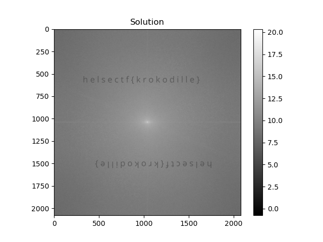

# image processing 1

fourier-transformasjoner kan brukes til mye innenfor bildeprosessering. man kan lett beregne en diskret fourier-transformasjon til et bilde i python:

```python
ft = numpy.fft.fft2(img_data)
```
en vanlig måte å visualisere en kompleks fourier transformasjon på er å skyve den slik at origo, og de laveste frekvensene havner i midten av visualiseringen. for å visualisere komplekse tall i vanlige grå-farger tar man gjerne normen / absoluttverdien til de komplekse verdiene. det er også vanlig å visualisere det med en logaritmisk skala, siden endringene i frekvens-intensiteten ofte er numerisk liten:

```python
fshift = numpy.fft.fftshift(ft)
spectrum = numpy.log(numpy.abs(fshift))
```

hva skjuler seg i dette bildet av et ekorn?

[⬇️ ekorn.png](ekorn.png)

# Writeup

I put what they told me into python and found on google hoow to show this image data using matplotlib. 

```python
from PIL import Image
import numpy as np
import matplotlib.pyplot as plt

# Load image using PIL
img_data = Image.open('ekorn.png')

# Using numpy to do stoff
ft = np.fft.fft2(img_data)
fshift = np.fft.fftshift(ft)
spectrum = np.log(np.abs(fshift))

# Found this on google to show the thingy.
plt.imshow(spectrum, cmap='gray')
plt.title('Solution')
plt.colorbar()
#plt.savefig('spectrum.png')
plt.show()
```



# Flag

```
helsectf{krokodille}