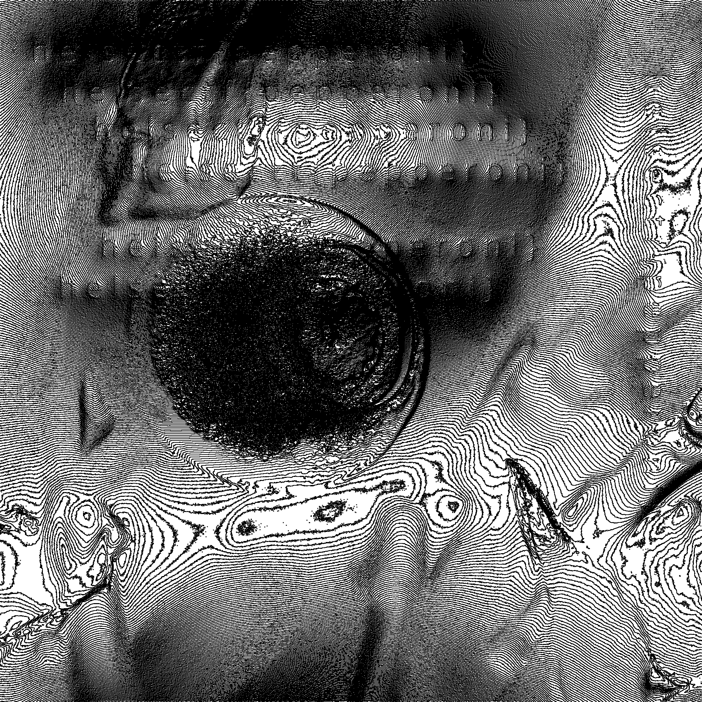

# image processing 2

fourier-transformasjonen til et bilde kan brukes til mye nyttig, blant annet til edge-detection. et high-pass filter vil slippe gjennom høye frekvenser, men stoppe lave frekvenser. de lave frekvensene beskriver de store og grove detaljene i bildet, mens de høye frekvensene beskriver små detaljer og harde linjer, teksturer og hår f.eks.

ved å fjerne de lave frekvensene kan vi lettere se de høye frekvensene og kanter og detaljer kommer bedre fram.

jeg har lagt ved et bilde av et blåbær, men det er dessverre nokså skadet og ting har glidd litt sammen, så det er umulig å se detaljene i bildet. se om du klarer å få frem noen detaljer!

tips! prøv gjerne litt forskjellige masker med forskjellige verdier.

[⬇️ blabr.png](blabr.png)

# Writeup

I just tossed it in photoshop, used `find edges` function then added a black background and blended them together to get this image: 



After a bit of looking I saw the flag.

# Flag

```
helsectf{pepperoni}
```