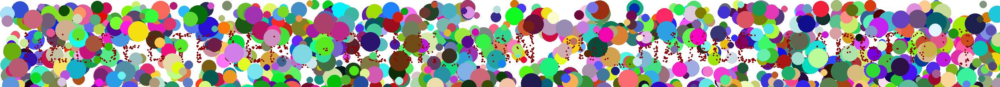

# prikker

En TV skjerm har klikket helt og viser bare prikker i ulike farger. Hvis man ser godt etter kan man kanskje se en hemmelig melding, spesielt hvis man finner den riktige fargen!

[⬇️ prikker.zip](prikker.zip)

# Writeup

I was given this image. 


Opened in Photoshop and quickly saw that there was within the 4000 layers some small red dots. I used the magic wand tool to remove the background and merge the layers but it would take forever. So I started making an automation in Photoshop but thought I'd google how to do pixel manupilation via Python.

After a while I found out that using the PIL library would be the easiest way to do it. I found a script that would do it for me and modified it a bit to fit my needs.

The first script I had merged all the frames and removed all colors below 10 in the R, G or B channel. 



This resulted in a lot of noise and the flag was not readable. So I modified it to only keep the red pixels. This resulted in a much cleaner image and the flag was readable.


# Script

[solve.py](solve.py) & [solve_red](solve_red.py)

```python
from PIL import Image, ImageSequence, ImageChops

# Load the GIF
gif_path = './prikker.gif'
gif = Image.open(gif_path)

# Extract frames and remove black background
frames = []
for frame in ImageSequence.Iterator(gif):
    print(f"Processing frame {len(frames) + 1} of {gif.n_frames}")

    # Convert to RGBA if necessary
    frame = frame.convert("RGBA")
    
    # Process to keep only the red pixels
    datas = frame.getdata()
    newData = []
    for item in datas:
        if item[0] > 100 and item[1] < 10 and item[2] < 10:
            newData.append(item)
        else:
            newData.append((0, 0, 0, 0))

    # Update frame data
    frame.putdata(newData)
    frames.append(frame) 

# Create a new image with a white background
merged_image = Image.new('RGBA', gif.size, (0, 137, 0, 255))

# Paste the frames next to each other
for frame in frames:
    merged_image = Image.alpha_composite(merged_image, frame)

# Save the result
merged_image_path = './merged_image_red_only.png'
merged_image.save(merged_image_path)
```

# Flag

```
helsectf{en_prikk_kan_ha_mange_farger!}
```